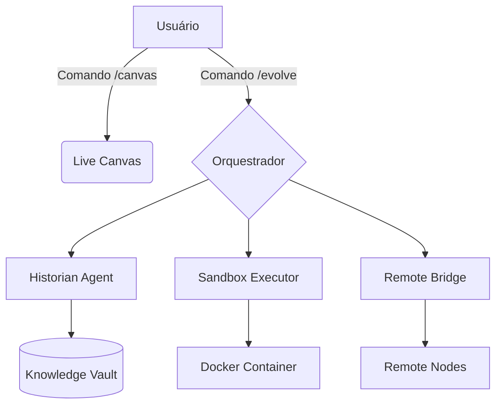

# Walkthrough: Evolução Antigravity (v2.0 - Clawd-Inspired)

Parabéns! O Antigravity evoluiu. Implementamos um conjunto robusto de novas capacidades inspiradas no ecossistema do Clawdbot.

## 🌟 O que mudou?

Agora eu possuo um "sistema nervoso" e uma "camada visual" que me permitem agir com muito mais inteligência e segurança.

### 1. Sistema de Memória (Knowledge Vault)
Agora eu posso "lembrar" de decisões importantes entre diferentes sessões de chat. O agente `historian` é o responsável por manter essa continuidade.
- **Localização**: [.agent/memory/](file:///c:/Users/RobsonSilva-AfixGraf/Habilidade_de_agente/.agent/memory/)

### 2. Execução Segura (Sandbox Docker)
Posso rodar códigos experimentais de forma isolada sem tocar nos seus arquivos permanentes (requer Docker Daemon rodando).
- **Skill**: `sandbox-executor`

### 3. Orquestração Multimodal (Live Canvas)
Implementamos uma interface visual dinâmica que pode ser aberta no seu browser a qualquer momento.
- **Comando**: `/canvas`
- **Visualização**: [.agent/canvas/state.html](file:///c:/Users/RobsonSilva-AfixGraf/Habilidade_de_agente/.agent/canvas/state.html)

### 4. Orquestração Remota (DESABILITADO)
Esta funcionalidade foi implementada mas desabilitada por motivos de segurança e controle.
- **Status**: 🛑 Inativo (.DISABLED)

---

## 🛠️ Como testar agora?

### `/evolve` - Sincronização de Sistema
Sempre que o sistema crescer, rode `/evolve` para garantir que todas as ferramentas estão mapeadas.

### `/canvas` - Visualização Ativa
Experimente pedir: *"Atualize o canvas com o diagrama da nossa nova arquitetura"*. Eu irei gerar o visual e você poderá vê-lo no browser.

---

## 📊 Status Final da Evolução

> [!TIP]
> Use o `historian` para perguntar coisas como: *"Quais foram as decisões arquiteturais da nossa última sessão?"* e ele consultará o Vault para você.
