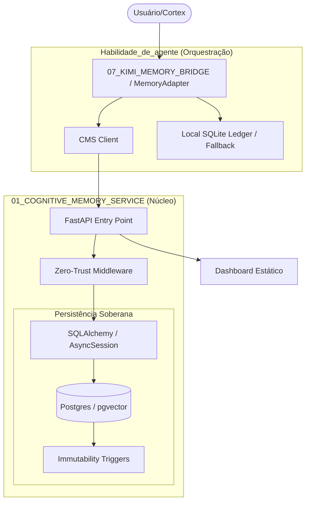

# 🏛️ ARQUITETURA CMS: TECNOLOGIA 01

Este documento detalha o funcionamento do **Cognitive Memory Service (CMS)**, seus componentes ativos e o fluxo de dados soberano.

## 🗺️ Mapa UML (Fluxo de Funcionamento)

## 📜 Lista Mestre de Arquivos Ativos

| Componente | Caminho Atual | Função | Status |
| :--- | :--- | :--- | :--- |
| **API Server** | `cognitive-memory-service/app/main.py` | Entrada FastAPI e Rotas. | **ATIVO** |
| **Persistência** | `cognitive-memory-service/app/db.py` | Conexão SQLAlchemy/Postgres. | **ATIVO** |
| **Client** | `EVOLUTION_SOVEREIGN_TEMPLATE/02_SOVEREIGN_INFRA/llm_integration/cms_client.py` | Integração do Cortex com a API. | **ATIVO** |
| **Adapter** | `antigravity_memory_backend/memory_adapter.py` | Orquestrador de Memória Híbrida. | **ATIVO** |
| **Schema** | `cognitive-memory-service/sql/001_init.sql` | DDL do Postgres (Imutabilidade). | **ATIVO** |
| **Verify** | `tests/smoke/verify_cms_api.py` | Verificador de integridade da API. | **ATIVO** |

## 📂 Identificação de Duplicatas (Destino: LIXO)

Os seguintes arquivos foram identificados como cópias ou versões legadas e serão movidos para `01_COGNITIVE_MEMORY_SERVICE/LIXO/`:

1.  `_QUARANTINE_ZOMBIES/llm_integration/cms_client.py` (Cópia legada)
2.  `PROJETOS/NEURO_FLOW_OS/libs/llm_integration/cms_client.py` (Projeto paralelo)
3.  `_QUARANTINE_ZOMBIES/EVO_IA/cms/` (Diretório inteiro legacy)
4.  `antigravity_memory_backend/demo_cms_memory.py` (Script de teste descartável)

---
**Nota**: A consolidação definitiva nestas pastas ocorrerá após a aprovação deste mapa. 🦅🛡️⚙️
