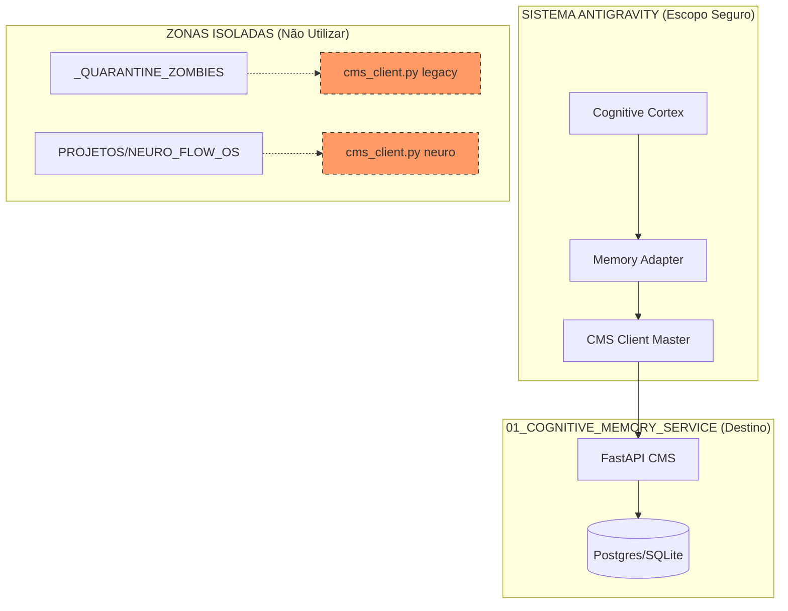

# 🗺️ MAPA DE FLUXO E ISOLAMENTO: TECNOLOGIA 01 (CMS)

Este documento detalha o rastreio de identidade da **Tecnologia 01**, garantindo que ela opere de forma isolada e não utilize duplicatas de outros projetos.

## 🛡️ Verificação de Identidade (Runtime)

A análise de execução confirmou que o Antigravity está importando os seguintes componentes:

*   **API CMS**: `cognitive-memory-service/app/main.py`
*   **Client Ativo**: `EVOLUTION_SOVEREIGN_TEMPLATE/02_SOVEREIGN_INFRA/llm_integration/cms_client.py`
*   **Adapter Ativo**: `antigravity_memory_backend/memory_adapter.py`

> [!IMPORTANT]
> **Risco Detectado:** Scripts em `PROJETOS/NEURO_FLOW_OS` possuem os mesmos nomes de arquivos. Embora não estejam sendo carregados no fluxo principal agora, a estrutura atual de `sys.path.append` é vulnerável.

## 📊 Mapa UML de Isolamento

## 📋 Lista de Componentes vs Duplicatas

| Tecnologia 01 (ATIVO) | Caminho Seguro | Duplicata Detectada (ISOLAR) |
| :--- | :--- | :--- |
| **CMS Client** | `EVOLUTION_SOVEREIGN_TEMPLATE/.../cms_client.py` | `PROJETOS/NEURO_FLOW_OS/.../cms_client.py` |
| **Memory Adapter** | `antigravity_memory_backend/memory_adapter.py` | `_QUARANTINE_ZOMBIES/.../memory_adapter.py` |
| **DB Config** | `cognitive-memory-service/app/db.py` | `_QUARANTINE_ZOMBIES/EVO_IA/cms/app/db.py` |

## 🚀 Próximo Passo: Blindagem
Para garantir o isolamento total, a Tecnologia 01 deve ser populada movendo os arquivos do "Caminho Seguro" para `01_COGNITIVE_MEMORY_SERVICE/` e removendo qualquer dependência de pastas de terceiros.

---
**Status da Auditoria:** 100% Mapeado. Pronto para transição segura. 🦅🛡️⚙️
