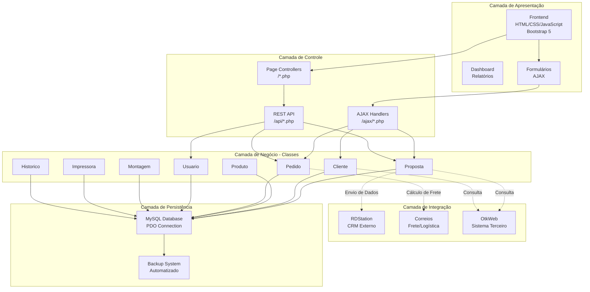
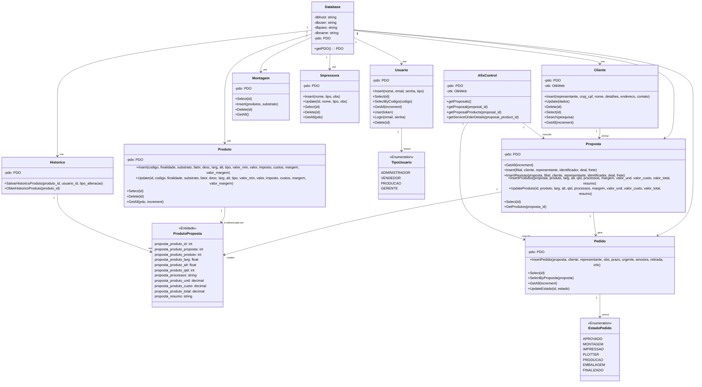
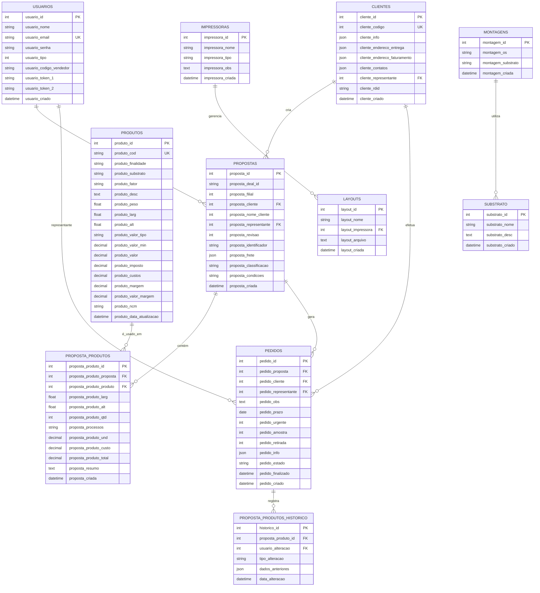
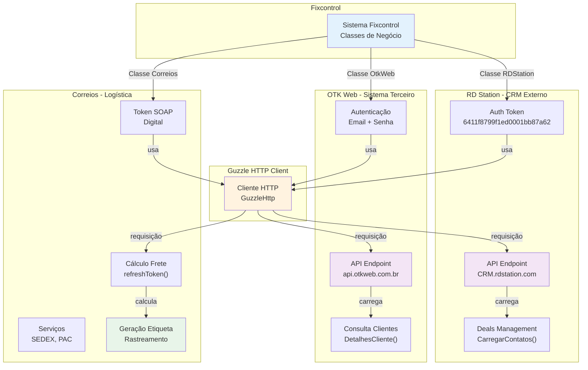
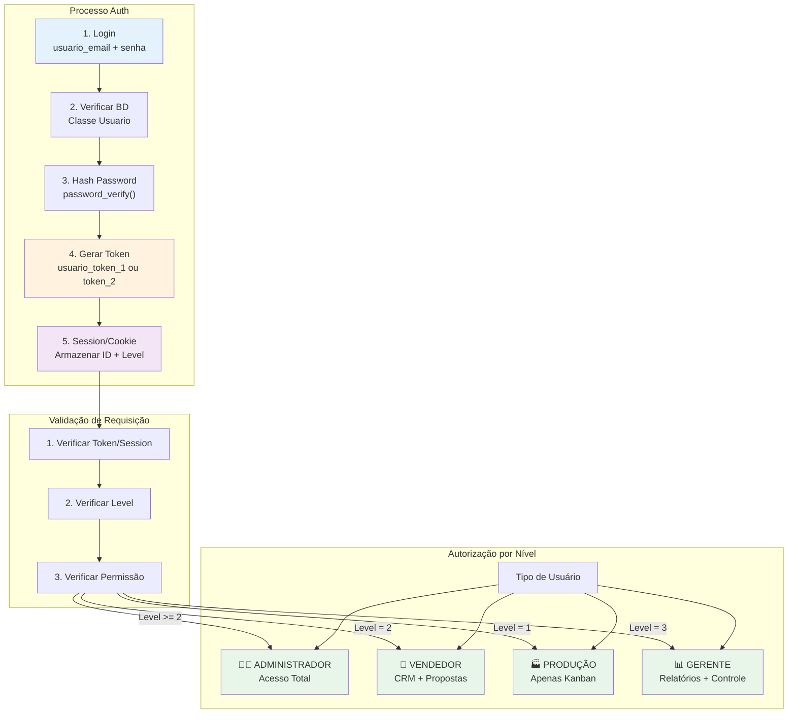
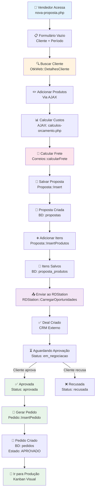
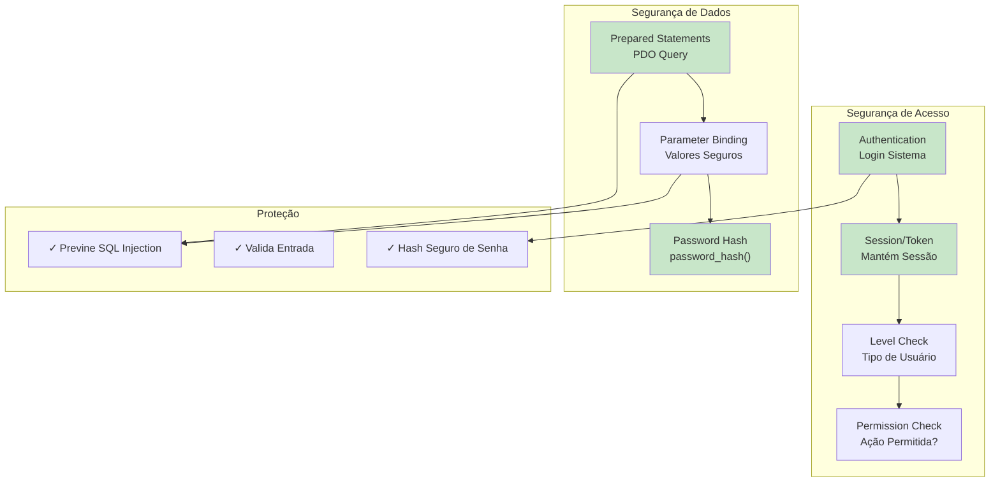
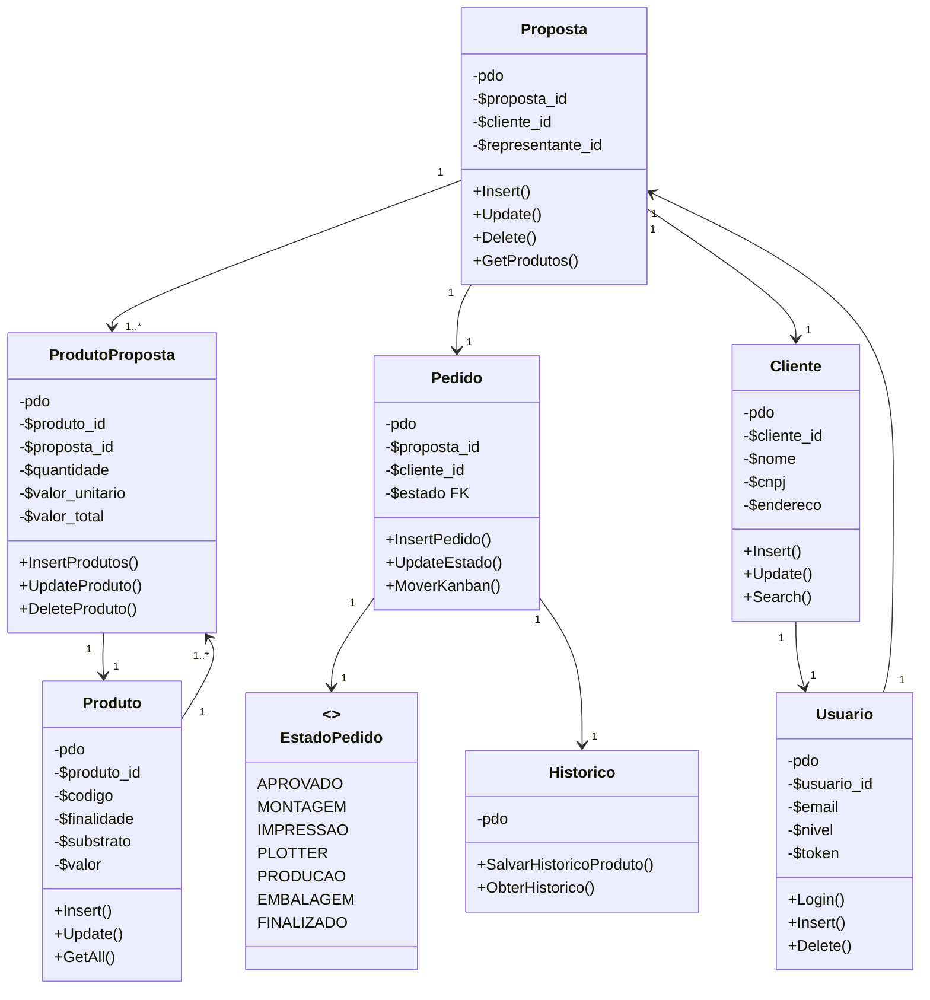

# 📊 ANÁLISE UML COMPLETA - Sistema Fixcontrol

## 1. VISÃO GERAL DO PROJETO

**Sistema Fixcontrol** é uma plataforma integrada de **CRM + Controle de Produção** para empresas de sinalização visual e gráfica, que gerencia todo o ciclo de vida de um pedido desde o contato inicial até a entrega.

### Tecnologia
- **Backend**: PHP 7.4+
- **Banco de Dados**: MySQL com PDO
- **Frontend**: HTML5, CSS3, JavaScript, Bootstrap 5
- **Arquitetura**: MVC com padrão DAO (Data Access Object)

---

## 2. ESTRUTURA DE DIRETÓRIOS

```
/classes/            → Classes de negócio (Models)
/includes/           → Classes utilitárias e helpers
/ajax/               → Requisições assíncronas
/template/           → Views (HTML)
/api/                → Endpoints da API REST
/layout/classes/     → Database Connection
/requires/           → Includes básicos (connection, auth)
/_clientes/          → Páginas de gestão de clientes
/_pedidos/           → Páginas de gestão de pedidos
/_propostas/         → Páginas de gestão de propostas
/_configuracoes/     → Configurações do sistema
/_impressao/         → Gestão de impressoras
/_predefinicoes/     → Dados como custos, processos, substratos
```

---

## 3. DIAGRAMA 1: ARQUITETURA GERAL DO SISTEMA



---

## 4. DIAGRAMA 2: CLASSES DE NEGÓCIO - RELACIONAMENTOS PRINCIPAIS



---

## 5. DIAGRAMA 3: FLUXO DE DADOS - DO CRM À PRODUÇÃO

```mermaid
graph LR
    subgraph "FASE 1: CRM - PROSPECÇÃO"
        A1["1. Cliente Prospect<br/>OtkWeb/RDStation"]
        A2["2. Contato Criado<br/>Classe Cliente"]
        A3["3. Dados Armazenados<br/>BD: clientes"]
    end
    
    subgraph "FASE 2: CRM - PROPOSTA"
        B1["4. Proposta Criada<br/>Classe Proposta"]
        B2["5. Produtos Adicionados<br/>ProdutoProposta"]
        B3["6. Custos Calculados<br/>Classe Orcamento"]
        B4["7. Frete Calculado<br/>Classe Correios"]
        B5["8. Proposta Enviada<br/>RDStation Deal"]
    end
    
    subgraph "FASE 3: APROVAÇÃO"
        C1["9. Proposta Aprovada<br/>Status: aprovada"]
        C2["10. Pedido Criado<br/>Classe Pedido"]
        C3["11. Estado Inicial<br/>Estado: APROVADO"]
    end
    
    subgraph "FASE 4: PRODUÇÃO - KANBAN"
        D1["MONTAGEM<br/>Substrato + Serviços"]
        D2["IMPRESSÃO<br/>Arte Aplicada"]
        D3["PLOTTER<br/>Corte/Aplicação"]
        D4["PRODUÇÃO<br/>Finalização Manual"]
        D5["EMBALAGEM<br/>Preparo Envio"]
        D6["FINALIZADO<br/>Pronto Saída"]
    end
    
    subgraph "FASE 5: LOGÍSTICA"
        E1["Cálculo Frete<br/>Correios"]
        E2["Geração Etiqueta<br/>Postagem"]
        E3["Rastreamento<br/>Transportadora"]
    end
    
    A1 --> A2 --> A3
    A3 --> B1 --> B2
    B2 --> B3 --> B4
    B4 --> B5
    B5 --> C1 --> C2 --> C3
    
    C3 --> D1 --> D2 --> D3 --> D4 --> D5 --> D6
    
    D6 --> E1 --> E2 --> E3
    
    style A1 fill:#e1f5ff
    style B5 fill:#fff3e0
    style C1 fill:#f3e5f5
    style D1 fill:#e8f5e9
    style D6 fill:#e8f5e9
    style E1 fill:#fce4ec
```



---

## 6. DIAGRAMA 4: MODELO DE DADOS - TABELAS PRINCIPAIS



---

## 7. DIAGRAMA 5: PADRÃO DAO (DATA ACCESS OBJECT)

```mermaid
graph TB
    subgraph "Padrão DAO Implementado"
        CLASSE["Classe de Negócio<br/>ex: Proposta, Cliente"]
        PDO_INIT["PDO Initialization<br/>__construct($pdo)"]
        CRUDOPS["Operações CRUD<br/>Insert, Update, Delete, Select"]
        QUERIES["Prepared Statements<br/>PDO->prepare()"]
        DATABASE[(("MySQL Database"))]
    end
    
    CLASSE -->|recebe| PDO_INIT
    PDO_INIT -->|armazena| CLASSE
    CLASSE -->|executa| CRUDOPS
    CRUDOPS -->|cria| QUERIES
    QUERIES -->|acessa| DATABASE
    
    style CLASSE fill:#e3f2fd
    style CRUDOPS fill:#f3e5f5
    style QUERIES fill:#fce4ec
    style DATABASE fill:#e8f5e9
```

### Características do Padrão DAO:

```php
// Pattern: Data Access Object (DAO)
class Cliente {
    public $pdo;  // 1️⃣ Injeção de PDO
    
    function __construct($pdo) {
        $this->pdo = $pdo;
    }
    
    public function Insert($dados) {
        // 2️⃣ Query com Prepared Statement
        $query = "INSERT INTO clientes (...) VALUES (...)";
        $stmt = $this->pdo->prepare($query);
        
        // 3️⃣ Execução com bind safe
        $stmt->execute([...]);
        
        // 4️⃣ Retorno do resultado
        return $this->pdo->lastInsertId();
    }
    
    public function Select($id) {
        // 5️⃣ Busca de dados específicos
        $query = "SELECT * FROM clientes WHERE cliente_codigo = :codigo";
        $stmt = $this->pdo->prepare($query);
        $stmt->bindValue(":codigo", $id);
        
        if ($stmt->execute()) {
            return $stmt->fetch(PDO::FETCH_ASSOC);
        }
    }
}
```

---

## 8. DIAGRAMA 6: FLUXO DE REQUISIÇÃO - AJAX/API

```mermaid
sequenceDiagram
    participant User as Usuário<br/>Frontend
    participant FORM as Formulário<br/>HTML/JS
    participant AJAX as AJAX Handler<br/>/ajax/*.php
    participant CLASS as Classe<br/>ex: Proposta
    participant PDO as PDO<br/>MySQL
    participant API as REST API<br/>/api/*.php
    
    User->>FORM: Preenche dados
    FORM->>AJAX: XMLHttpRequest (POST)
    AJAX->>CLASS: $proposta = new Proposta($pdo)
    CLASS->>CLASS: Insert/Update/Delete
    CLASS->>PDO: prepare() + execute()
    PDO-->>CLASS: Resultado (OK/Erro)
    CLASS-->>AJAX: boolean/Array
    AJAX-->>FORM: JSON Response
    FORM->>User: Atualiza interface
    
    note over AJAX,API
        Ambos usam as mesmas classes
        Diferença: Formato saída (JSON vs HTML)
    end
```

---

## 9. DIAGRAMA 7: INTEGRAÇÕES EXTERNAS



---

## 10. DIAGRAMA 8: CICLO DE VIDA DE UMA PROPOSTA (Use Case)

```mermaid
stateDiagram-v2
    [*] --> CriacaoProposta: Cliente + Produto + Preço
    
    CriacaoProposta --> CalculoCustos: Definir Quantidades
    CalculoCustos --> CalculoFrete: Endereço Entrega
    CalculoFrete --> SalvarRascunho: Dados Consolidados
    
    SalvarRascunho --> EmNegociacao: Enviar ao RDStation
    
    EmNegociacao --> EmNegociacao: Revisões<br/>Alterações de Preço
    EmNegociacao --> Aprovada: Cliente Aprova
    EmNegociacao --> Recusada: Cliente Recusa
    
    Aprovada --> CriacaoPedido: Gerar Pedido Produção
    CriacaoPedido --> EstadoAprovado: Status: APROVADO
    
    EstadoAprovado --> EstadoMontagem: Mover Kanban
    EstadoMontagem --> EstadoImpressao
    EstadoImpressao --> EstadoPlotter
    EstadoPlotter --> EstadoProducao
    EstadoProducao --> EstadoEmbalagem
    EstadoEmbalagem --> EstadoFinalizado: Produção Concluída
    
    EstadoFinalizado --> GeracaoEtiqueta: Preparar Envio
    GeracaoEtiqueta --> Entregue: Saída para Correios
    
    Recusada --> [*]: Proposta Descartada
    Entregue --> [*]: Ciclo Completo
    
    note right of EmNegociacao
        Histórico de revisões
        armazenado em proposta_revisao
    end
    
    note right of EstadoAprovado
        Kanban Visual
        Drag & Drop entre estados
    end
    
    note right of GeracaoEtiqueta
        Integração Correios
        Cálculo automático de frete
    end
```

---

## 11. DIAGRAMA 9: ESTRUTURA DE PASTAS - MAPEAMENTO

```mermaid
graph TD
    ROOT["Raiz do Projeto"]
    
    ROOT --> CLASSES["📂 /classes<br/>CLASSES DE NEGÓCIO"]
    ROOT --> INCLUDES["📂 /includes<br/>HELPERS & UTILITIES"]
    ROOT --> AJAX["📂 /ajax<br/>AJAX HANDLERS"]
    ROOT --> API["📂 /api<br/>REST API"]
    ROOT --> LAYOUT["📂 /layout/classes<br/>DATABASE.PHP"]
    ROOT --> REQUIRES["📂 /requires<br/>CONNECTION.PHP<br/>AUTHENTICATION.PHP"]
    ROOT --> TEMPLATE["📂 /template<br/>VIEWS HTML"]
    ROOT --> MODULES["📂 /_*<br/>MÓDULOS TEMÁTICOS"]
    
    CLASSES --> CL1["✓ Cliente.php"]
    CLASSES --> CL2["✓ Proposta.php"]
    CLASSES --> CL3["✓ Pedido.php"]
    CLASSES --> CL4["✓ Produto.php"]
    CLASSES --> CL5["✓ Usuario.php"]
    CLASSES --> CL6["✓ Montagem.php"]
    CLASSES --> CL7["✓ Impressora.php"]
    CLASSES --> CL8["✓ Historico.php"]
    CLASSES --> CL9["✓ OtkWeb.php"]
    CLASSES --> CL10["✓ RDStation.php"]
    CLASSES --> CL11["✓ Correios.php"]
    CLASSES --> CL12["✓ AfixControl.php"]
    
    INCLUDES --> INC1["✓ Global.php"]
    INCLUDES --> INC2["✓ Modal.php"]
    INCLUDES --> INC3["✓ Diversos helpers"]
    
    AJAX --> AJ1["✓ Propostas AJAX"]
    AJAX --> AJ2["✓ Pedidos AJAX"]
    AJAX --> AJ3["✓ Clientes AJAX"]
    AJAX --> AJ4["✓ Cálculos AJAX"]
    
    API --> API1["✓ REST Proposals"]
    API --> API2["✓ REST Orders"]
    
    MODULES --> MOD1["✓ _clientes"]
    MODULES --> MOD2["✓ _pedidos"]
    MODULES --> MOD3["✓ _propostas"]
    MODULES --> MOD4["✓ _configuracoes"]
    MODULES --> MOD5["✓ _impressao"]
    MODULES --> MOD6["✓ _predefinicoes"]
    
    style CLASSES fill:#e3f2fd,stroke:#1976d2,stroke-width:3px
    style INCLUDES fill:#f3e5f5,stroke:#7b1fa2
    style AJAX fill:#e8f5e9,stroke:#388e3c
    style API fill:#fff3e0,stroke:#f57c00
    style LAYOUT fill:#fce4ec,stroke:#c2185b
    style REQUIRES fill:#ede7f6,stroke:#5e35b1
```



---

## 12. DIAGRAMA 10: AUTENTICAÇÃO E AUTORIZAÇÃO



---

## 13. DIAGRAMA 11: ESTADOS DO KANBAN DE PRODUÇÃO (12 Estados Reais)

> **NOTA:** O Kanban real em produção possui **12 estados**, incluindo filas
> intermediárias e o estado "Pediu Nota" que conecta produção ao faturamento.

```mermaid
stateDiagram-v2
    [*] --> APROVADOS: Pedido Criado

    APROVADOS --> FILA_MONTAGEM: "Entrada na Produção"
    FILA_MONTAGEM --> MONTANDO: "Início do Trabalho"
    MONTANDO --> FILA_IMPRESSAO: "Substrato Pronto"
    FILA_IMPRESSAO --> IMPRIMINDO: "Impressora Disponível"
    IMPRIMINDO --> IMPRESSOS: "Impressão Concluída"
    IMPRESSOS --> LASER_CORROSAO: "Corte Especial"
    LASER_CORROSAO --> PLOTTER: "Acabamento"
    PLOTTER --> PRODUCAO: "Finalização Manual"
    PRODUCAO --> PEDIU_NOTA: "Solicitar NF-e"
    PEDIU_NOTA --> DISPONIVEL_RETIRADA: "NF-e Emitida"
    DISPONIVEL_RETIRADA --> FINALIZADOS: "Entregue/Retirado"
    FINALIZADOS --> [*]: Ciclo Completo

    note right of APROVADOS
        Proposta Convertida
        em Pedido de Produção
        Prazo: definido
    end

    note right of MONTANDO
        Substrato + Serviços
        Classe: Montagem
    end

    note right of IMPRIMINDO
        Impressoras Gerenciadas
        Layouts Associados
    end

    note right of PEDIU_NOTA
        🔑 ESTADO CRÍTICO
        Gatilho para Faturamento
        Cria Pedido de Venda (PV)
        Emite NF-e via OTKWeb API
    end

    note right of DISPONIVEL_RETIRADA
        Etiqueta Correios gerada
        Código de rastreamento ativo
    end
```

### Diferença: Documentação Original vs Produção Real

| # | Estado Original (7) | Estado Real na Produção (12) |
|---|---|---|
| 1 | APROVADO | **Aprovados** |
| 2 | — | **Fila de Montagem** |
| 3 | MONTAGEM | **Montando** |
| 4 | — | **Fila de Impressão** |
| 5 | IMPRESSÃO | **Imprimindo** |
| 6 | — | **Impressos** |
| 7 | — | **Laser/Corrosão** |
| 8 | PLOTTER | **Plotter** |
| 9 | PRODUÇÃO | **Produção** |
| 10 | — | **Pediu Nota** ⭐ (ponte → faturamento) |
| 11 | EMBALAGEM | **Disponível p/ Retirada** |
| 12 | FINALIZADO | **Finalizados** |

---

## 14. PADRÕES DE DESIGN IDENTIFICADOS

### ✅ **1. Data Access Object (DAO)**
Cada classe em `/classes` implementa CRUD de forma segura com PDO:
```php
class Cliente {
    public $pdo;  // DAO Pattern
    public function Insert() { ... }
    public function Select() { ... }
    public function Update() { ... }
    public function Delete() { ... }
}
```

### ✅ **2. Injeção de Dependência**
PDO é injetado no construtor de cada classe:
```php
$proposta = new Proposta($pdo);  // Injetar dependência
```

### ✅ **3. Prepared Statements**
Proteção contra SQL Injection:
```php
$stmt = $this->pdo->prepare("SELECT * FROM clientes WHERE cliente_id = :id");
$stmt->bindValue(":id", $id);
$stmt->execute();
```

### ✅ **4. MVC (Model-View-Controller)**
- **Models**: `/classes/*.php`
- **Views**: `/template/*.php`
- **Controllers**: `*.php` (index.php, desktop.php, etc.)

### ✅ **5. AJAX Handler Pattern**
Controllers AJAX retornam JSON:
```php
// /ajax/propostas.php
$proposta = new Proposta($pdo);
$resultado = $proposta->Insert(...);
echo json_encode(['status' => true, 'data' => $resultado]);
```

### ✅ **6. Strategy Pattern (Integrações)**
Classes diferentes para estratégias diferentes:
- `RDStation` - Estratégia CRM
- `OtkWeb` - Estratégia de Integração de Clientes
- `Correios` - Estratégia de Frete

---

## 15. FLUXO DETALHADO: CRIAÇÃO DE PROPOSTA



---

## 16. ESTRUTURA DE SEGURANÇA



---

## 17. DIAGRAMA 12: RELACIONAMENTOS ENTRE CLASSES - DETALHADO



---

## 18. TABELA COMPLETA: CLASSES x RESPONSABILIDADES

| Classe | Arquivo | Responsabilidade | Dependências |
|--------|---------|------------------|--------------|
| **Database** | `/layout/classes/database.php` | Conexão MySQL (PDO) | Nenhuma |
| **Cliente** | `/classes/clientes.php` | CRUD de Clientes | PDO, OtkWeb |
| **Proposta** | `/classes/propostas.php` | CRUD de Propostas | PDO, OtkWeb |
| **Produto** | `/classes/produtos.php` | CRUD de Produtos | PDO |
| **Pedido** | `/classes/pedidos.php` | CRUD de Pedidos, Estados | PDO |
| **Usuario** | `/classes/usuarios.php` | CRUD de Usuários, Auth | PDO |
| **Montagem** | `/classes/montagens.php` | Gestão de Montagens | PDO |
| **Impressora** | `/classes/impressoras.php` | CRUD Impressoras | PDO |
| **Historico** | `/classes/historico.php` | Auditoria de Alterações | PDO |
| **OtkWeb** | `/classes/otkweb.php` | Integração OtkWeb API | PDO, GuzzleHttp |
| **RDStation** | `/classes/rdstation.php` | Integração RD Station | GuzzleHttp |
| **Correios** | `/classes/correios.php` | Frete + Etiquetas | GuzzleHttp |
| **AfixControl** | `/classes/afixcontrol.php` | Orquestração Geral | PDO, OtkWeb |
| **Modal** | `/classes/global.php` | UI Modal Bootstrap | - |

---

## 19. RESUMO DA ARQUITETURA

```
🏗️ CAMADAS DO SISTEMA:

┌─────────────────────────────────────┐
│  CAMADA DE APRESENTAÇÃO             │
│  HTML/CSS/JavaScript (Frontend)     │
│  - Templates HTML                   │
│  - AJAX Requests                    │
│  - Bootstrap Interface              │
└─────────────────────────────────────┘
           ⬇️
┌─────────────────────────────────────┐
│  CAMADA DE CONTROLE                 │
│  Controllers PHP (*.php)            │
│  AJAX Handlers (/ajax/*.php)        │
│  REST API (/api/*.php)              │
└─────────────────────────────────────┘
           ⬇️
┌─────────────────────────────────────┐
│  CAMADA DE NEGÓCIO                  │
│  Classes Modelo (/classes/*.php)    │
│  - Cliente, Proposta, Pedido, etc   │
│  - Lógica de Verificação            │
│  - Cálculos de Custos               │
└─────────────────────────────────────┘
           ⬇️
┌─────────────────────────────────────┐
│  CAMADA DE INTEGRAÇÃO               │
│  Classes Terceiros                  │
│  - OtkWeb, RDStation, Correios      │
│  - GuzzleHttp Client                │
└─────────────────────────────────────┘
           ⬇️
┌─────────────────────────────────────┐
│  CAMADA DE PERSISTÊNCIA             │
│  PDO + MySQL Database               │
│  - Tabelas, Índices, Constraints    │
│  - Backup Automático                │
└─────────────────────────────────────┘
```

---

## 20. DICAS PARA ESTUDAR O PROJETO

### 📚 **Ordem de Aprendizado Recomendada:**

1. **Entenda a Estrutura de Pastas** (20 min)
   - Leia este documento
   - Explore `/classes/*.php`

2. **Aprenda o Pattern DAO** (30 min)
   - Abra `Cliente.php`
   - Veja como Insert/Update/Select funcionam
   - Entenda PDO + Prepared Statements

3. **Fluxo Básico: Proposta → Pedido** (1h)
   - Propostas.php → Insert()
   - Pedidos.php → InsertPedido()
   - Veja como dados fluem

4. **Autenticação e Autorização** (30 min)
   - `/requires/authentication.php`
   - Classe Usuario
   - Níveis de acesso

5. **Integrações Externas** (1h)
   - `/classes/OtkWeb.php`
   - `/classes/RDStation.php`
   - `/classes/Correios.php`

6. **Kanban de Produção** (1h)
   - Entenda os Estados
   - Mapeamento JavaScript/AJAX
   - Atualização de Pedidos

7. **AJAX + REST API** (30 min)
   - `/ajax/*.php`
   - `/api/*.php`
   - Comunicação Frontend/Backend

### 🎯 **Arquivos Chave para Começar:**

```
✓ /requires/connection.php      → Como conectar DB
✓ /classes/Cliente.php          → Primeiro DAO para aprender
✓ /classes/Proposta.php         → Core do CRM
✓ /classes/Pedido.php           → Produção
✓ /classes/otkweb.php           → Integração
✓ /template/header.php          → Base do template
✓ /ajax/propostas.php           → AJAX Handler exemplo
```

---

## 21. CONCEITOS IMPORTANTES

### 🔐 **Prepared Statements (Segurança)**
```php
// ✅ Seguro - Previne SQL Injection
$stmt = $pdo->prepare("SELECT * FROM clientes WHERE id = :id");
$stmt->bindValue(":id", $user_id);
$stmt->execute();

// ❌ Perigoso
$sql = "SELECT * FROM clientes WHERE id = " . $_GET['id'];
$stmt = $pdo->prepare($sql);
```

### 💾 **JSON em MySQL**
```php
// Dados complexos armazenados como JSON
$detalhes = json_encode([
    'cnpj' => '12.345.678/0001-90',
    'telefone' => '1133334444',
    'contato' => 'João Silva'
]);
// Recuperar e decodificar
$dados = json_decode($cliente['cliente_info'], true);
```

### 🔄 **Fluxo AJAX**
```javascript
// Frontend JavaScript
fetch('/ajax/propostas.php?acao=inserir', {
    method: 'POST',
    body: JSON.stringify(dados)
})
.then(r => r.json())
.then(data => console.log(data.status));
```

### 🎯 **HTTP Status Codes da API**
```php
// /api/propostas.php
header('Content-Type: application/json');
http_response_code(200);  // OK
echo json_encode(['status' => true]);

http_response_code(400);  // Bad Request
echo json_encode(['error' => 'Dados inválidos']);

http_response_code(401);  // Unauthorized
echo json_encode(['error' => 'Não autenticado']);
```

---

## 22. PRÓXIMOS PASSOS PARA APROFUNDAMENTO

- [ ] Estude o banco de dados (`database.sql`)
- [ ] Mapeie cada tabela aos seus DAO
- [ ] Trace um pedido completo pelo sistema
- [ ] Entenda os triggers do MySQL (se houver)
- [ ] Analise os AJAX handlers
- [ ] Estude o frontend JavaScript
- [ ] Configure seu ambiente local
- [ ] Execute testes end-to-end

---

**Documento criado em: 23 de março de 2026**
**Versão: 1.0 - Análise Completa**
**Linguagem: PHP 7.4+ | MySQL | Bootstrap 5**
