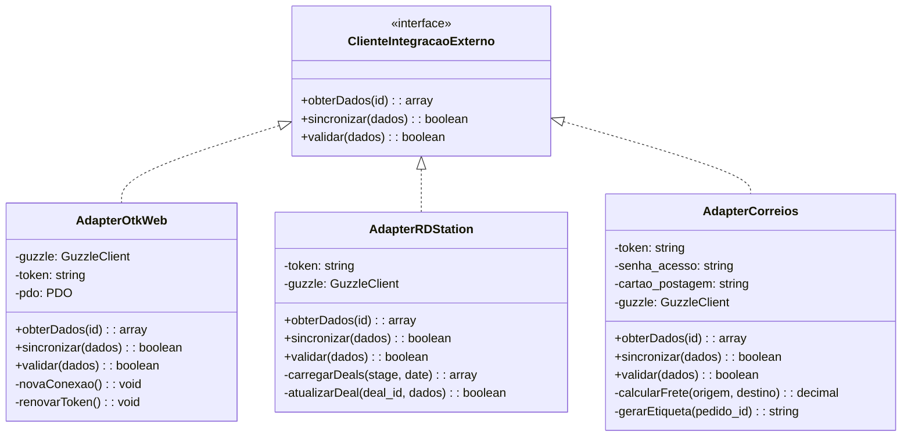
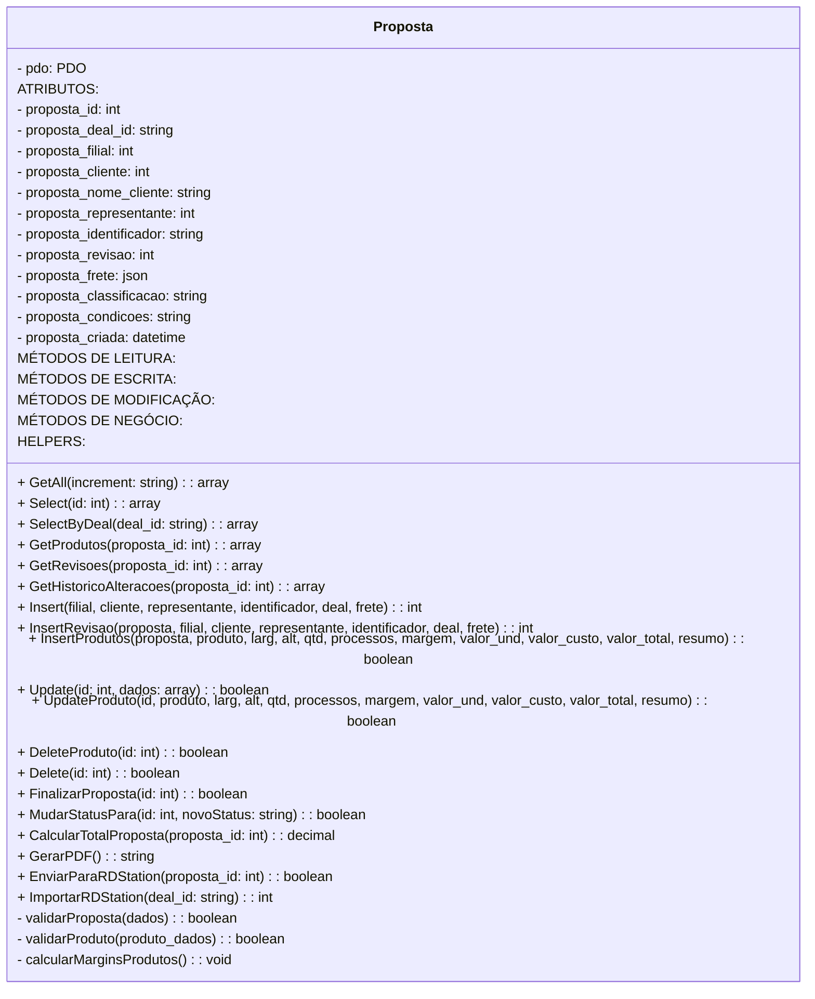
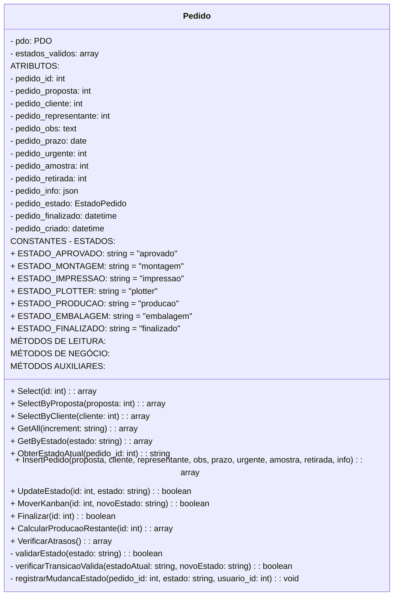
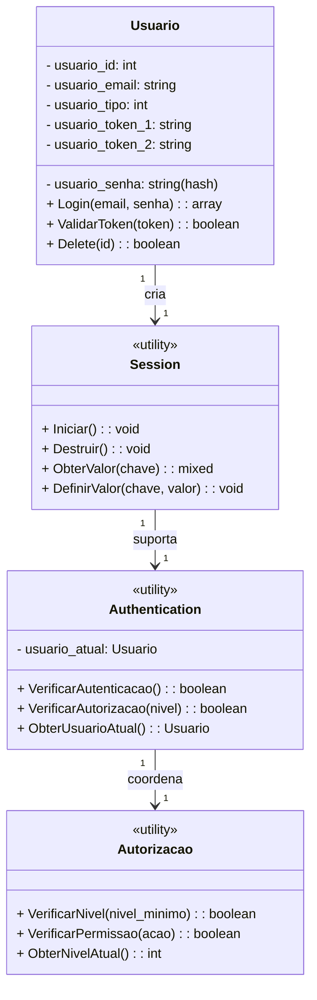
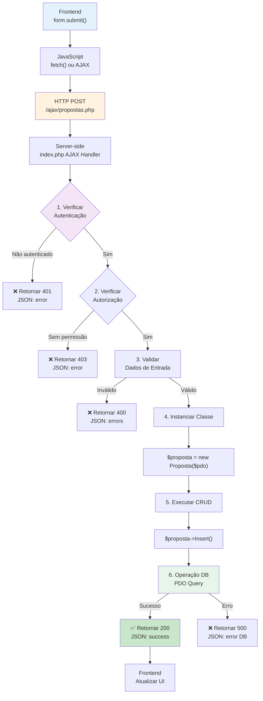
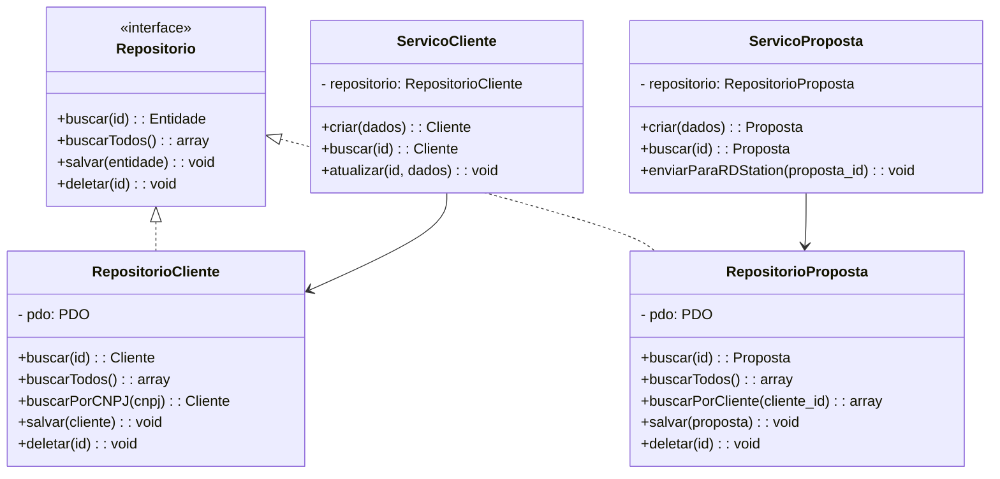
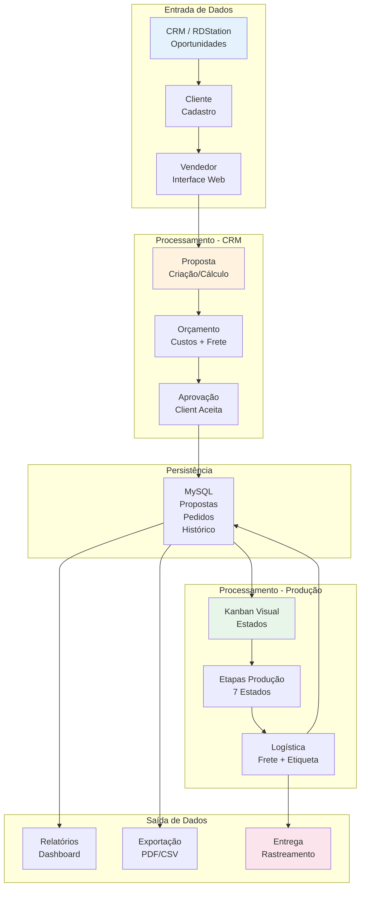

# 🎨 DIAGRAMAS UML AVANÇADOS - HERANÇA, ABSTRAÇÃO E PADRÕES

## 1. DIAGRAMA ESTRUTURAL: HERANÇA DE CLASSES (POSSÍVEL REFATORAÇÃO)

Embora o projeto atual **NÃO utilize herança explícita**, presento a estrutura que **PODERIA** ser implementada para melhorar a arquitetura:

```mermaid
classDiagram
    class EntidadeAbstrata {
        <<abstract>>
        #pdo: PDO
        #tabela: string
        #id_field: string
        +Insert(dados)*
        +Update(id, dados)*
        +Delete(id)*
        +Select(id): array
        +GetAll(filtro): array
        #validar(dados)*: boolean
    }
    
    class Cliente {
        -pdo: PDO
        -otk: OtkWeb
        +Insert(rd_id, representante, cnpj_cpf, nome, detalhes, endereco, contato): array
        +Update(dados): boolean
        +Delete(id): boolean
        +Search(pesquisa): array
        +GetAll(increment): array
    }
    
    class Produto {
        -pdo: PDO
        +Insert(codigo, finalidade, substrato...): int
        +Update(id, codigo, finalidade...): int
        +Delete(id): int
        +Select(id): array
        +GetAll(pdo): array
    }
    
    class Usuario {
        -pdo: PDO
        -nivel: int
        -token: string
        +Insert(nome, email, senha, tipo): boolean
        +Login(email, senha): array
        +Delete(id): boolean
        +Verify(token): array
    }
    
    class Pedido {
        -pdo: PDO
        -estado: EstadoPedido
        +InsertPedido(...): array
        +UpdateEstado(id, estado): boolean
        +MoverKanban(id, novo_estado): boolean
        +GetByProposta(proposta): array
    }
    
    class Proposta {
        -pdo: PDO
        -otk: OtkWeb
        +Insert(filial, cliente, representante...): int
        +InsertRevisao(...): int
        +InsertProdutos(...): boolean
        +UpdateProduto(...): boolean
        +GetAll(increment): array
        +GetProdutos(proposta_id): array
    }
    
    class Montagem {
        -pdo: PDO
        +Insert(produtos, substrato): boolean
        +Select(id): array
        +Delete(id): boolean
        +GetAll(): array
    }
    
    class Impressora {
        -pdo: PDO
        +Insert(nome, tipo, obs): int
        +Update(id, nome, tipo, obs): int
        +Select(id): array
        +Delete(id): int
    }
    
    class Historico {
        -pdo: PDO
        +SalvarHistoricoProduto(produto_id, usuario_id, tipo): boolean
        +ObterHistoricoProduto(produto_id): array
        +ObterHistoricoCompleto(): array
    }
    
    EntidadeAbstrata <|-- Cliente
    EntidadeAbstrata <|-- Produto
    EntidadeAbstrata <|-- Usuario
    EntidadeAbstrata <|-- Pedido
    EntidadeAbstrata <|-- Proposta
    EntidadeAbstrata <|-- Montagem
    EntidadeAbstrata <|-- Impressora
    EntidadeAbstrata <|-- Historico
```



## 2. DIAGRAMA: INTEGRAÇÕES COM PADRÃO ADAPTER



## 3. DIAGRAMA UML DETALHADO: CLASSE PROPOSTA



## 4. DIAGRAMA UML DETALHADO: CLASSE PEDIDO



## 5. DIAGRAMA: FLUXO DE ESTADOS DO PEDIDO (STATE PATTERN)

```mermaid
stateDiagram-v2
    [*] --> Aprovado
    
    Aprovado --> Montagem: moverParaMontagem()
    
    Montagem --> Impressao: moverParaImpressao()
    
    Impressao --> Plotter: moverParaPlotter()
    
    Plotter --> Producao: moverParaProducao()
    
    Producao --> Embalagem: moverParaEmbalagem()
    
    Embalagem --> Finalizado: finalizarPedido()
    
    Finalizado --> [*]
    
    Aprovado --> Aprovado: Permanece aguardando
    Montagem --> Montagem: Processamento subsequente
    Impressao --> Impressao: Reprocessamento possível
    
    note right of Aprovado
        - Pedido criado
        - Pronto para produção
        - Validação final
    end
    
    note right of Montagem
        - Substrato preparado
        - Serviços básicos
        - Classe: Montagem
    end
    
    note right of Impressao
        - Arte impressa
        - Validação visual
        - Classe: Impressora
    end
    
    note right of Finalizado
        - Produto completo
        - Pronto para entrega
        - Gerar etiqueta Correios
    end
```

## 6. DIAGRAMA DE COMPOSIÇÃO: PROPOSTA CONTÉM PRODUTOS

```mermaid
classDiagram
    class Proposta {
        - proposta_id: int
        - cliente_id: int
        - proposta_criada: datetime
        + Insert(): int
        + GetProdutos(): array
    }
    
    class ProdutoProposta {
        - proposta_produto_id: int
        - proposta_id: int (FK)
        - produto_id: int (FK)
        - quantidade: int
        - valor_unitario: decimal
        - valor_total: decimal
        + Insert(): boolean
        + Update(): boolean
        + Delete(): boolean
    }
    
    class Produto {
        - produto_id: int
        - codigo: string
        - finalidade: string
        - substrato: string
        - valor_base: decimal
        + Insert(): int
        + GetDados(): array
    }
    
    class Processamento {
        - processo_id: int
        - nome: string
        - custo: decimal
        + GetTodos(): array
    }
    
    Proposta "1" *-- "1..*" ProdutoProposta : contém
    ProdutoProposta "1" o-- "1" Produto : referencia
    ProdutoProposta "1" o-- "0..*" Processamento : utiliza
    
    note right of Proposta
        Uma proposta pode ter
        múltiplos produtos
        (composição)
    end
```

## 7. DIAGRAMA DE AGREGAÇÃO: PEDIDO REFERENCIA PROPOSTA

```mermaid
classDiagram
    class Pedido {
        - pedido_id: int
        - proposta_id: int (FK)
        - cliente_id: int
        - estado: string
    }
    
    class Proposta {
        - proposta_id: int
        - cliente_id: int
    }
    
    class Cliente {
        - cliente_id: int
        - nome: string
    }
    
    class ProdutoProposta {
        - produto_id: int
    }
    
    Pedido "1" --> "1" Proposta : referencia via agregação
    Proposta "1" --> "1" Cliente : associado a
    Proposta "1" --> "1..*" ProdutoProposta : contém
    
    note right of Pedido
        Pedido usa dados de Proposta
        (agregação, não composição)
        Proposta pode existir sem Pedido
    end
```

## 8. DIAGRAMA: CLASSES DE INTEGRAÇÃO - CLIENTE HTTP COMUM

```mermaid
classDiagram
    class GuzzleHttpClient {
        <<library>>
        + post(url, options): Response
        + get(url, options): Response
        + put(url, options): Response
        + delete(url, options): Response
    }
    
    class OtkWeb {
        - guzzle: GuzzleHttpClient
        - token: string
        - pdo: PDO
        + __construct(pdo)
        + DetalhesCliente(cliente_id): array
        + ObterOportunidades(empresa): array
        - novaConexao(): void
    }
    
    class RDStation {
        - token: string
        + CarregarContatos(stage, date, page): array
        + CarregarOportunidades(empresa): array
        + AtualizarDeal(deal_id, dados): boolean
        + CriarDeal(dados): int
    }
    
    class Correios {
        - token: string
        - cartao_postagem: string
        - client: GuzzleHttpClient
        + CalcularFrete(origem, destino, peso): decimal
        + GerarEtiqueta(pedido_id): string
        + RastrearEnvio(codigo): array
        - refreshToken(): void
    }
    
    OtkWeb --> GuzzleHttpClient : usa
    RDStation --> GuzzleHttpClient : usa
    Correios --> GuzzleHttpClient : usa
    
    note right of GuzzleHttpClient
        Biblioteca HTTP compartilhada
        Todas as classes de integração
        utilizam para requisições
    end
```

## 9. DIAGRAMA: CAMADA DE AUTENTICAÇÃO



## 10. DIAGRAMA: FLUXO DE DADOS EM AJAX REQUEST



## 11. DIAGRAMA: PADRÃO FACTORY PARA CRIAR ENTIDADES

```mermaid
classDiagram
    class EntidadeFactory {
        <<static>>
        - pdo: PDO
        + criarCliente(pdo): Cliente
        + criarProposta(pdo): Proposta
        + criarPedido(pdo): Pedido
        + criarUsuario(pdo): Usuario
        + criarProduto(pdo): Produto
    }
    
    class Cliente {
        - pdo: PDO
    }
    
    class Proposta {
        - pdo: PDO
    }
    
    class Pedido {
        - pdo: PDO
    }
    
    class Usuario {
        - pdo: PDO
    }
    
    class Produto {
        - pdo: PDO
    }
    
    EntidadeFactory ..> Cliente : cria
    EntidadeFactory ..> Proposta : cria
    EntidadeFactory ..> Pedido : cria
    EntidadeFactory ..> Usuario : cria
    EntidadeFactory ..> Produto : cria
    
    note right of EntidadeFactory
        Factory Pattern para
        centralizar criação de objetos
        Simplifica injeção de PDO
    end
```

### Implementação do Factory:
```php
class EntidadeFactory {
    public static function criar($tipo, $pdo) {
        switch($tipo) {
            case 'cliente':
                return new Cliente($pdo);
            case 'proposta':
                return new Proposta($pdo);
            case 'pedido':
                return new Pedido($pdo);
            default:
                throw new Exception("Tipo inválido");
        }
    }
}

// Uso:
$cliente = EntidadeFactory::criar('cliente', $pdo);
$proposta = EntidadeFactory::criar('proposta', $pdo);
```

## 12. DIAGRAMA: OBSERVADOR (OBSERVER PATTERN) PARA HISTÓRICO

```mermaid
classDiagram
    class Observable {
        <<interface>>
        +attach(observer): void
        +detach(observer): void
        +notify(): void
    }
    
    class Pedido {
        - observers: Observer[]
        - estado_atual: string
        +setState(novoEstado): void
        +attach(observer): void
        +notify(): void
    }
    
    class Observer {
        <<interface>>
        +update(pedido): void
    }
    
    class LoggerHistorico {
        +update(pedido): void
    }
    
    class NotificadorEmail {
        +update(pedido): void
    }
    
    class AtualizadorDashboard {
        +update(pedido): void
    }
    
    Observable <|.. Pedido
    Observer <|.. LoggerHistorico
    Observer <|.. NotificadorEmail
    Observer <|.. AtualizadorDashboard
    
    Pedido --> Observer : notifica
    
    note right of Pedido
        Quando estado muda,
        todos os observers
        são notificados
    end
```

## 13. TABELA: COMPARAÇÃO DE PADRÕES NO PROJETO

| Padrão | Implementação Atual | Implementação Ideal | Benefício |
|--------|-------------------|-------------------|-----------|
| **DAO** | ✅ Sim, em todas classes | ✅ Já existe | Segurança, Reutilização |
| **Injeção Dependência** | ✅ Sim, via constructor | ✅ Já existe | Testabilidade, Desacoplamento |
| **Prepared Statements** | ✅ Sim, em todas queries | ✅ Já existe | Previne SQL Injection |
| **MVC** | ✅ Partial | ⚠️ Melhorar | Organização, Manutenibilidade |
| **Herança (Base)** | ❌ Não | ⚠️ Considerar | Código DRY, Reutilização |
| **Interface** | ❌ Não | ✅ Recomendado | Contrato de classes |
| **Factory** | ❌ Não | ✅ Recomendado | Centralizar criação |
| **Observer** | ❌ Não | ✅ Para histórico | Auditoria, Notificações |
| **Adapter** | ✅ Implicit | ✅ Melhorar | Integração externa |
| **Singleton DB** | ❌ Não | ⚠️ Considerar | Uma conexão central |

## 14. DIAGRAMA: PROPOSTA PARA CLASSE BASE (REFATORAÇÃO)

```php
<?php
// Proposta Atual
class Proposta {
    public $pdo;
    
    function __construct($pdo) {
        $this->pdo = $pdo;
    }
    
    public function Insert(...) { }
    public function Update(...) { }
    public function Delete(...) { }
    public function Select($id) { }
}

// ⬇️ REFATORAÇÃO SUGERIDA ⬇️

// 1️⃣ Criar Classe Base Abstrata
abstract class EntidadeBase {
    protected $pdo;
    protected $tabela;
    
    public function __construct($pdo) {
        $this->pdo = $pdo;
    }
    
    abstract public function Insert($dados);
    abstract public function Update($id, $dados);
    abstract public function Delete($id);
    
    public function Select($id) {
        $query = "SELECT * FROM {$this->tabela} WHERE id = :id";
        $stmt = $this->pdo->prepare($query);
        $stmt->bindValue(":id", $id);
        $stmt->execute();
        return $stmt->fetch(PDO::FETCH_ASSOC);
    }
}

// 2️⃣ Proposta herda de EntidadeBase
class Proposta extends EntidadeBase {
    protected $tabela = 'propostas';
    
    public function Insert($filial, $cliente, $representante, ...) {
        // Implementação específica
        $query = "INSERT INTO {$this->tabela} VALUES (...)";
        // ...
    }
    
    public function Update($id, $dados) {
        // Implementação específica
    }
    
    public function Delete($id) {
        // Implementação específica
    }
}
```

## 15. DIAGRAMA COMPLETO: REPOSITÓRIO (REPOSITORY PATTERN)



## 16. DOCUMENTAÇÃO: COMO ESTENDER O SISTEMA

### Adicionar uma Nova Entidade (exemplo: Contrato)

```php
<?php
// 1. Criar classe seguindo o padrão DAO
// /classes/contratos.php

class Contrato extends EntidadeBase {
    protected $tabela = 'contratos';
    
    public function Insert($proposta_id, $cliente_id, $termos) {
        $query = "INSERT INTO contratos (contrato_proposta, contrato_cliente, contrato_termos, contrato_ativo) 
                 VALUES (:proposta, :cliente, :termos, 1)";
        $stmt = $this->pdo->prepare($query);
        $stmt->execute([
            ':proposta' => $proposta_id,
            ':cliente' => $cliente_id,
            ':termos' => $termos
        ]);
        
        return $this->pdo->lastInsertId();
    }
    
    public function Update($id, $dados) {
        // Implementação....
    }
    
    public function Delete($id) {
        // Implementação...
    }
}

// 2. Criar AJAX handler
// /ajax/contratos.php

<?php
require_once __DIR__ . "/../requires/connection.php";
require_once __DIR__ . "/../requires/authentication.php";
require_once __DIR__ . "/../classes/contratos.php";

header('Content-Type: application/json');

if ($_SERVER['REQUEST_METHOD'] === 'POST') {
    $acao = $_POST['acao'] ?? '';
    
    $contrato = new Contrato($pdo);
    
    if ($acao === 'criar') {
        $id = $contrato->Insert($_POST['proposta'], $_POST['cliente'], $_POST['termos']);
        echo json_encode(['status' => true, 'id' => $id]);
    }
}
?>

// 3. Usar em uma página
// /_contratos/novo-contrato.php

<?php
require_once __DIR__ . "/../classes/contratos.php";

$contrato = new Contrato($pdo);
// Usar o objeto...
?>
```

## 17. DOCUMENTAÇÃO: ADICIONAR NOVO ATRIBUTO

### Adicionar campo em Proposta (exemplo: desconto_total)

```sql
-- 1. Alterar tabela
ALTER TABLE propostas ADD COLUMN proposta_desconto_total DECIMAL(10, 2) DEFAULT 0;

-- 2. Criar migração (backup automático)
-- Já existe em: /backup_database.php
```

```php
// 3. Atualizar classe Proposta
class Proposta {
    public function Insert($filial, $cliente, $representante, $identificador, $deal, $frete, $desconto_total) {
        $query = "INSERT INTO propostas 
                 (proposta_filial, proposta_cliente, ..., proposta_desconto_total) 
                 VALUES (:filial, :cliente, ..., :desconto_total)";
        
        $stmt = $this->pdo->prepare($query);
        $stmt->execute([
            // ... outros parametros
            ':desconto_total' => $desconto_total
        ]);
        
        return $this->pdo->lastInsertId();
    }
}

// 4. Usar no AJAX
// /ajax/propostas.php
$desconto = $_POST['desconto_total'] ?? 0;
$id_proposta = $proposta->Insert(..., $desconto);
```

---

## 18. CHECKLIST: BOAS PRÁTICAS IMPLEMENTADAS

- ✅ Prepared Statements em todas as queries
- ✅ PDO Exceptions
- ✅ Validação de entrada
- ✅ Base de dados normalizada
- ✅ Autenticação por token
- ✅ Logs de auditoria (Historico)
- ⚠️ Separação MVC (parcial - melhorar)
- ⚠️ Tratamento de erros (melhorar)
- ❌ Testes unitários
- ❌ Versionamento de API
- ❌ Documentação de API (swagger)
- ❌ Rate limiting

---

## 19. GUIA: LEITURA DE CÓDIGO - POR TIPO

### 🔷 Para Iniciantes
1. Leia `/layout/classes/database.php` - Entender conexão
2. Leia `/classes/cliente.php` - Entender DAO simples
3. Explore `/includes/global.php` - Entender helpers

### 🔶 Para Intermediários
1. Leia `/classes/proposta.php` - Relacionamentos
2. Leia `/classes/pedido.php` - Estados
3. Explore `/ajax/propostas.php` - Fluxo AJAX

### 🔴 Para Avançados
1. Leia `/classes/otkweb.php` - Integração complexa
2. Leia `/classes/RDStation.php` - HTTP Client
3. Analise fluxo completo: Proposta → Pedido → Produção

---

## 20. DIAGRAMA FINAL: VISÃO 360° DO SISTEMA



---

**Resumo Executivo:**
- **12 Classes principais** com padrão DAO
- **7 Integrações externas** via HTTP
- **3 Camadas** (Apresentação, Negócio, Dados)
- **Arquitetura MVC** parcialmente implementada
- **Oportunidades** para refatoração com herança base e padrões avançados

