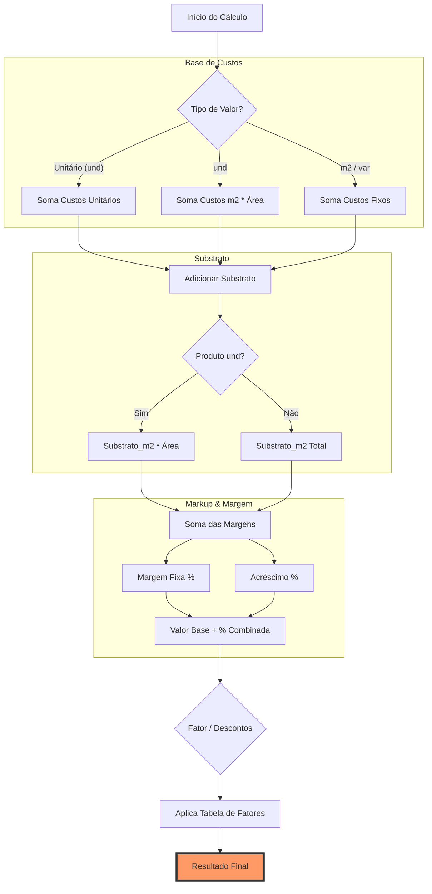

# Relatório de Escrutínio: Lógica de Precificação AfixControl

Este documento detalha o mapeamento da lógica de precificação do model `Produto` e identifica inconsistências críticas entre a Interface (UI), o Motor de Cálculo AJAX e a Classe Base.

## 1. Mapeamento de Campos (UML de Fluxo)

## 2. Escrutínio dos Campos

| Campo | Função no Preço | Impacto |
| :--- | :--- | :--- |
| **Substrato** | Fornece o custo base do material por m². | **Alto**: É a fundação do preço para a maioria dos produtos. |
| **Tipo de Valor** | Define se o cálculo é por unidade ou por m². | **Crítico**: Altera a fórmula de área (`L * A / 1.000.000`). |
| **Dimensões (L/A)** | Multiplicador de área para produtos unitários. | **Alto**: Erros aqui distorcem o custo de material e processos m². |
| **Custos (Lista)** | Agrega processos (Impressão, Furo, etc). | **Variável**: Pode ser fixo por peça ou proporcional à área. |
| **Margem** | Lucro base do produto. | **Linear**: Multiplicador direto sobre o custo total acumulado. |
| **Acréscimo** | Margem adicional ou ajuste de mercado. | **Linear**: Somado à margem no motor de cálculo atual. |
| **Imposto** | Carga tributária. | **Inconsistente**: Presente na UI, mas ignorado no `calcularValorUnitario`. |

## 3. Inconsistências Detectadas (Pé no Chão)

### ⚠️ A Lacuna do Imposto
Na UI e no banco de dados, o campo `produto_imposto` existe. No entanto, o método `Produto::calcularValorUnitario` (o "coração" do sistema) **ignora completamente o imposto**. Atualmente, ele apenas soma Margem + Acréscimo.
> **Risco**: O preço exibido pode estar "limpo", sem considerar a mordida tributária, reduzindo o lucro real.

### ⚠️ A Ambiguidade do "Variável" (var)
O tipo `var` é tratado como `m2` no `else` da lógica de custos. Isso pode gerar confusão se o usuário espera que um produto variável se comporte como unitário em certas condições.

### ⚠️ Soma de Porcentagens vs Multiplicação Cascata
O sistema soma as margens: `(Margem + Acréscimo)`. 
- Exemplo: 100% + 30% = 130%.
- Se fossem aplicados em cascata: `Custo * 2.0 (100%) * 1.3 (30%) = 260%`.
A lógica atual é mais conservadora ( Markup Simples), mas precisa estar clara para o comercial.

### ⚠️ O "Fator" Fantasma
O campo **Fator** (Tabela de Descontos) é selecionado na UI, mas não é processado no recálculo automático da classe `Produto`. Isso significa que, se um custo mudar, o produto será atualizado **sem considerar o desconto do fator**, possivelmente ficando mais caro do que deveria na tabela geral.

## 4. O que deveríamos ter no Resultado Final?

Para uma precificação **Soberana (V3.0)**, o resultado deveria ser:

$$Preço = [(Custos + Substrato) \times (1 + MargemTotal)] \times (1 + Imposto)$$

*Onde o Fator de Desconto/Tabela deve atuar como o ajuste final de soberania sobre o valor resultante.*
