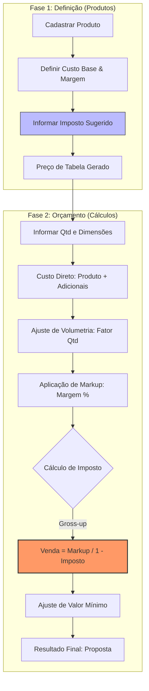

# Fluxo Arquitetônico: Do Produto à Proposta (AfixControl)

Este relatório detalha como os dados definidos no módulo de **Produtos** fluem e são transformados no módulo de **Propostas/Orçamentos**, focando na aplicação de impostos e bases de cálculo.

## 1. Ciclo de Vida do Preço (UML de Fluxo Estendido)

## 2. Entendimento do Fluxo de Impostos

Conforme escrutinado nos arquivos `ajax/calculos.php` e `ajax/calculos-orcamento.php`:

| Conceito | Descrição Técnica | Observação |
| :--- | :--- | :--- |
| **Origem do Imposto** | O percentual vem do cadastro do produto (`produto_imposto`). | O Admin define, o Vendedor consome. |
| **Momento da Aplicação** | Ocorre no final da cadeia de cálculo do Orçamento. | Não afeta o "Preço de Tabela" puro, apenas a Proposta. |
| **Método de Cálculo** | **Gross-up (Por Dentro)**: `Valor / (1 - Tax/100)`. | Garante que o imposto incida sobre o valor final de venda. |
| **Cálculo Reverso** | Se o preço unitário é inserido manualmente, o imposto é considerado "embutido". | O sistema evita bitributação ou distorção em ajustes manuais. |

## 3. Análise da "Base de Cálculo" na Proposta

A base de cálculo para a proposta é dinâmica e depende do **Tipo de Valor** configurado no produto:

1.  **Tipo `und` (Unitário)**:
    *   A base é o `produto_valor` (Preço de Tabela).
    *   Multiplicado pela Quantidade da proposta.
    *   Adiciona processos unitários ou % sobre essa base.

2.  **Tipo `m2` (Metro Quadrado)**:
    *   A base é `produto_valor` (Preço por m²).
    *   Multiplicado pela Área (`L * A / 1.000.000`) e pela Quantidade.
    *   Adiciona processos m² ou % sobre essa base.

3.  **Tipo `var` (Variável)**:
    *   Considera valores manuais de custo e venda informados no momento do orçamento.
    *   Ignora fórmulas automáticas de substrato/custo.

## 4. Conclusão do Escrutínio Mental

Compreendi perfeitamente a separação de responsabilidades:
-   **Produtos**: É o "Almoxarifado de Inteligência". Define as premissas (Quanto custa, quanto quero ganhar, qual o imposto padrão).
-   **Cálculos (Orçamento)**: É o "Motor de Vendas". Pega as premissas, ajusta à realidade da escala (quantidade) e do fisco (imposto por dentro) para gerar o valor de fechamento.
