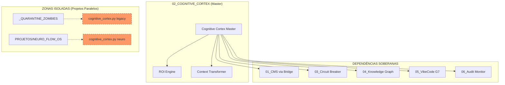

# 🧠 MAPA DE FLUXO E ISOLAMENTO: TECNOLOGIA 02 (COGNITIVE CORTEX)

Este documento detalha o rastreio de identidade da **Tecnologia 02**, o orquestrador central de inteligência do sistema.

## 🛡️ Verificação de Identidade (Runtime)

O Cortex é o "Cérebro" que coordena todas as outras tecnologias numeradas. A análise confirmou:

*   **Cortex Master**: `EVOLUTION_SOVEREIGN_TEMPLATE/02_SOVEREIGN_INFRA/llm_integration/cognitive_cortex.py`
*   **Status**: Ativo e integrando com Technology 01 (CMS) via Bridge.

## 📊 Mapa UML de Orquestração e Isolamento

## 📜 Lista de Componentes Master (Cortex Core)

| Componente | Caminho Atual | Função | Status |
| :--- | :--- | :--- | :--- |
| **Orchestrator** | `llm_integration/cognitive_cortex.py` | Lógica central de decisão. | **ATIVO** |
| **ROI Engine** | `llm_integration/roi_engine.py` | Cálculo de economia de tokens. | **ATIVO** |
| **Context Tool** | `llm_integration/context_transformer.py` | Compressão semântica de contexto. | **ATIVO** |

## 📂 Duplicatas Identificadas (Destino: LIXO/02)

Para evitar conflitos de execução, as seguintes versões não-Antigravity serão ignoradas pelo motor principal:

1.  `_QUARANTINE_ZOMBIES/llm_integration/cognitive_cortex.py`
2.  `PROJETOS/NEURO_FLOW_OS/libs/llm_integration/cognitive_cortex.py`

---
**Status da Auditoria:** Mapeamento de Orquestração concluído. Pronto para centralização na pasta `02_`. 🦅🛡️⚙️
