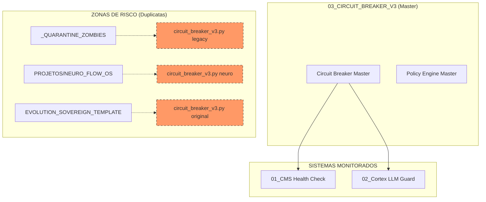

# 🛡️ MAPA DE ISOLAMENTO: TECNOLOGIA 03 (CIRCUIT BREAKER V3)

Este documento detalha o rastreio de identidade da **Tecnologia 03**, o Escudo Atômico de proteção contra falhas e vazamentos.

## ⚙️ Verificação de Identidade (Runtime)

O Circuit Breaker V3 é o mecanismo de segurança fail-closed:

*   **Breaker Master**: `03_CIRCUIT_BREAKER_V3/circuit_breaker_master.py`
*   **Policy Master**: `03_CIRCUIT_BREAKER_V3/policy_engine_master.py`
*   **Status**: Ativo, monitorando o CMS (Tecnologia 01) e o Cortex (Tecnologia 02).

## 📊 Mapa UML de Proteção e Isolamento

## 📜 Lista de Componentes Master (Security Core)

| Componente | Caminho Atual | Função | Status |
| :--- | :--- | :--- | :--- |
| **Circuit Breaker** | `03_/circuit_breaker_master.py` | Monitora saúde infra e trava saídas. | **ATIVO** |
| **Policy Engine** | `03_/policy_engine_master.py` | Valida intenções contra lista de risco. | **ATIVO** |

## 📂 Duplicatas Identificadas (Destino: LIXO/03)

As seguintes versões serão ignoradas para evitar "vazamento de lógica" de segurança:

1.  `EVOLUTION_SOVEREIGN_TEMPLATE/02_SOVEREIGN_INFRA/llm_integration/circuit_breaker_v3.py`
2.  `_QUARANTINE_ZOMBIES/llm_integration/circuit_breaker_v3.py`
3.  `PROJETOS/NEURO_FLOW_OS/libs/llm_integration/circuit_breaker_v3.py`

---
**Status da Auditoria:** Mapeamento de Segurança concluído. 🛡️⚙️🚀
