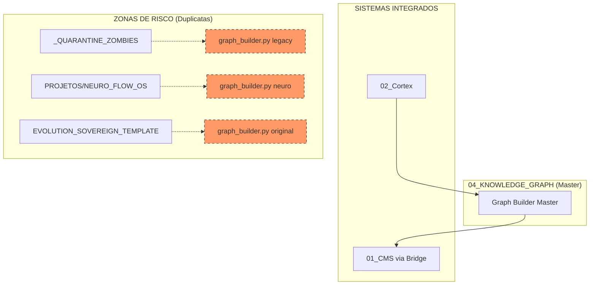

# 🕸️ MAPA DE ISOLAMENTO: TECNOLOGIA 04 (KNOWLEDGE GRAPH)

Este documento detalha o rastreio de identidade da **Tecnologia 04**, o motor de extração de conceitos e relações da Sprint B.

## ⚙️ Verificação de Identidade (Runtime)

O Knowledge Graph é o responsável por "aprender" novos conceitos a partir das decisões do Cortex:

*   **Graph Master**: `04_KNOWLEDGE_GRAPH/core/graph_builder_master.py`
*   **Status**: Ativo, integrado ao Cortex (Tecnologia 02) para processamento assíncrono de soluções.

## 📊 Mapa UML de Extração e Isolamento

## 📜 Lista de Componentes Master (Graph Core)

| Componente | Caminho Atual | Função | Status |
| :--- | :--- | :--- | :--- |
| **Graph Builder** | `04_KNOWLEDGE_GRAPH/core/graph_builder_master.py` | Extrai nós e links de textos técnicos. | **ATIVO** |

## 📂 Duplicatas Identificadas (Destino: LIXO/04)

As seguintes versões serão ignoradas para evitar poluição no grafo de conhecimento:

1.  `EVOLUTION_SOVEREIGN_TEMPLATE/02_SOVEREIGN_INFRA/llm_integration/graph_builder.py`
2.  `_QUARANTINE_ZOMBIES/llm_integration/graph_builder.py`
3.  `PROJETOS/NEURO_FLOW_OS/libs/llm_integration/graph_builder.py`

---
**Status da Auditoria:** Mapeamento de Extração concluído. 🕸️⚙️🚀
