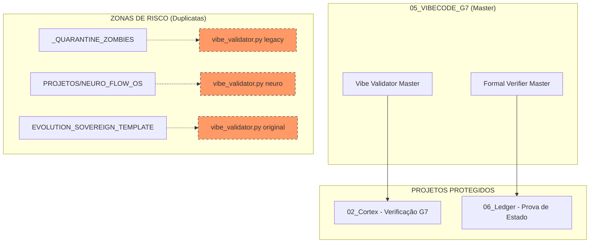

# 💎 MAPA DE ISOLAMENTO: TECNOLOGIA 05 (VIBECODE G7 / VALIDATION)

Este documento detalha o rastreio de identidade da **Tecnologia 05**, o motor de validação formal de axiomas e prova matemática de estado.

## ⚙️ Verificação de Identidade (Runtime)

O VibeCode G7 é o "Auditor Matemático" do sistema:

*   **Validator Master**: `05_VIBECODE_G7/core/vibe_validator_master.py`
*   **Verifier Master**: `05_VIBECODE_G7/core/formal_verifier_master.py`
*   **Status**: Ativo, atuando como gate final antes de confirmar qualquer decisão do Cortex.

## 📊 Mapa UML de Validação e Isolamento

## 📜 Lista de Componentes Master (Validation Core)

| Componente | Caminho Atual | Função | Status |
| :--- | :--- | :--- | :--- |
| **Vibe Validator** | `05_VIBECODE_G7/core/vibe_validator_master.py` | Verifica axiomas de soberania no código. | **ATIVO** |
| **Formal Verifier** | `05_VIBECODE_G7/core/formal_verifier_master.py` | Gera provas matemáticas SHA-256 do Ledger. | **ATIVO** |

## 📂 Duplicatas Identificadas (Destino: LIXO/05)

As seguintes versões serão ignoradas para garantir a integridade matemática do sistema:

1.  `EVOLUTION_SOVEREIGN_TEMPLATE/02_SOVEREIGN_INFRA/llm_integration/vibe_validator.py`
2.  `EVOLUTION_SOVEREIGN_TEMPLATE/02_SOVEREIGN_INFRA/llm_integration/formal_verifier.py`
3.  `_QUARANTINE_ZOMBIES/llm_integration/vibe_validator.py`
4.  `PROJETOS/NEURO_FLOW_OS/libs/llm_integration/vibe_validator.py`

---
**Status da Auditoria:** Mapeamento de Validação concluído. 💎⚙️🚀
