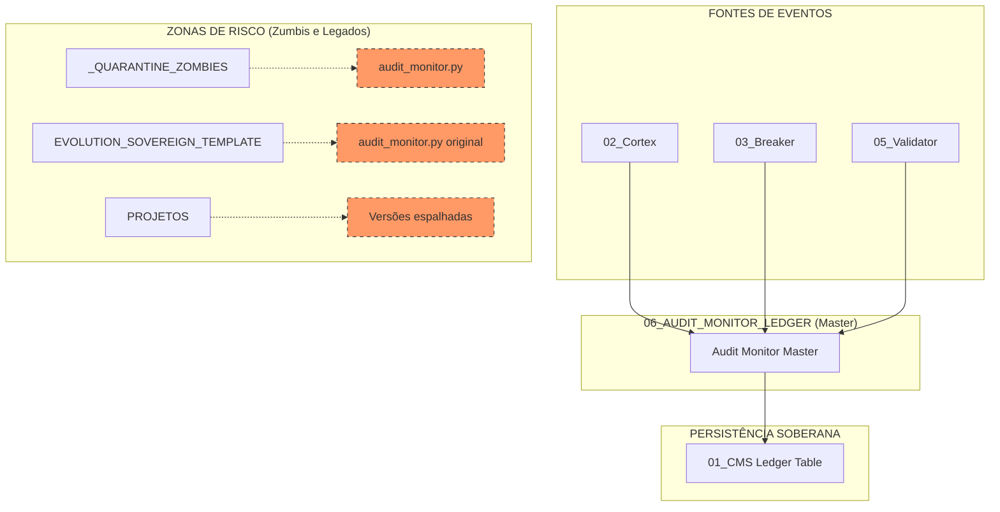

# 🔦 MAPA DE ISOLAMENTO: TECNOLOGIA 06 (AUDIT MONITOR & LEDGER)

Este documento detalha o rastreio de identidade da **Tecnologia 06**, o Guardião da Verdade Forense do Antigravity.

## ⚙️ Verificação de Identidade (Runtime)

O Audit Monitor é o responsável por registrar cada intenção, decisão e ação do sistema no Ledger inalterável:

*   **Audit Master**: `06_AUDIT_MONITOR_LEDGER/core/audit_monitor_master.py`
*   **Database Principal**: `01_COGNITIVE_MEMORY_SERVICE/database/evolution.db` (Tabela `audit_ledger`)
*   **Status**: Ativo, monitorando o Cortex (T02) e o Circuit Breaker (T03).

## 📊 Mapa UML de Auditoria e Isolamento

## 📜 Lista de Componentes Master (Forensic Core)

| Componente | Caminho Atual | Função | Status |
| :--- | :--- | :--- | :--- |
| **Audit Monitor** | `06_/core/audit_monitor_master.py` | Gera hashes forenses e grava no Ledger. | **ATIVO** |

## 📂 Duplicatas Identificadas (Destino: LIXO/06)

As seguintes versões serão ignoradas para evitar registros duplicados ou inseguros:

1.  `_QUARANTINE_ZOMBIES/llm_integration/audit_monitor.py`
2.  `EVOLUTION_SOVEREIGN_TEMPLATE/02_SOVEREIGN_INFRA/llm_integration/audit_monitor.py`
3.  `PROJETOS/NEURO_FLOW_OS/libs/llm_integration/audit_monitor.py`

---
**Status da Auditoria:** Mapeamento Forense concluído. 🔦⚙️🚀
