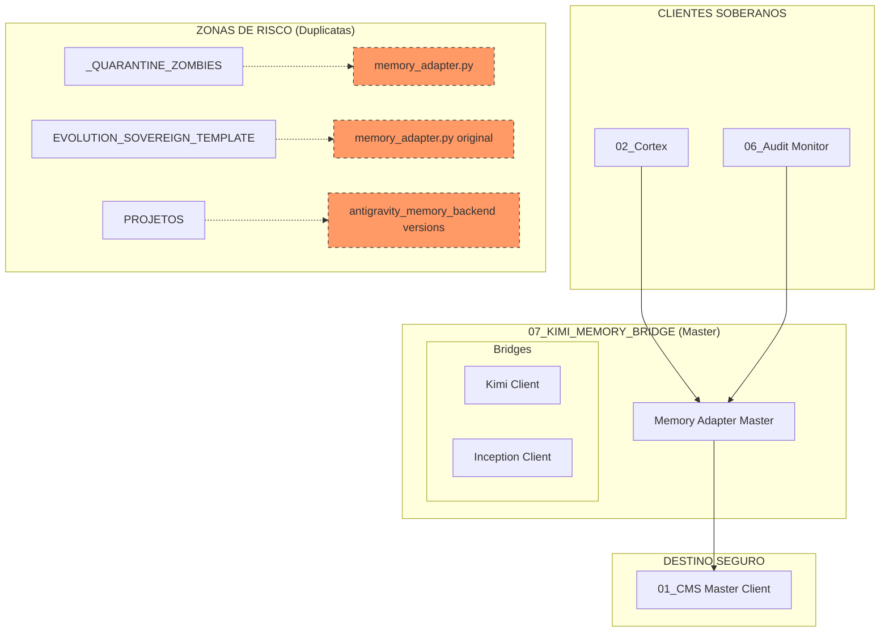

# 🌉 MAPA DE ISOLAMENTO: TECNOLOGIA 07 (KIMI MEMORY BRIDGE)

Este documento detalha o rastreio de identidade da **Tecnologia 07**, a ponte exclusiva de comunicação de dados.

## ⚙️ Verificação de Identidade (Runtime)

A Ponte de Memória é o "Único Caminho" para leitura e escrita de fatos cognitivos:

*   **Adapter Master**: `07_KIMI_MEMORY_BRIDGE/core/memory_adapter_master.py` (Movendo para Core)
*   **Clients Master**: `07_KIMI_MEMORY_BRIDGE/bridges/` (Kimi, Inception, etc.)
*   **Status**: Ativo, blindando o CMS (T01) contra chamadas diretas não auditadas.

## 📊 Mapa UML de Integração e Isolamento

## 📜 Lista de Componentes Master (Bridge Core)

| Componente | Caminho Atual | Função | Status |
| :--- | :--- | :--- | :--- |
| **Memory Adapter** | `07_/core/memory_adapter_master.py` | Orquestra Fallback (CMS vs Local) e desduplicação. | **ATIVO** |
| **Kimi Bridge** | `07_/bridges/kimi_client.py` | Cliente Moonshot integrado à memória soberana. | **ATIVO** |

## 📂 Duplicatas Identificadas (Destino: LIXO/07)

As seguintes versões serão ignoradas para evitar "memória fragmentada" ou vazamentos:

1.  `_QUARANTINE_ZOMBIES/memory/memory_adapter.py`
2.  `_QUARANTINE_ZOMBIES/antigravity_memory_backend.py`
3.  `EVOLUTION_SOVEREIGN_TEMPLATE/02_SOVEREIGN_INFRA/memory/memory_adapter.py`
4.  `PROJETOS/NEURO_FLOW_OS/libs/memory/memory_adapter.py`

---
**Status da Auditoria:** Mapeamento de Ponte concluído. 🌉⚙️🚀
