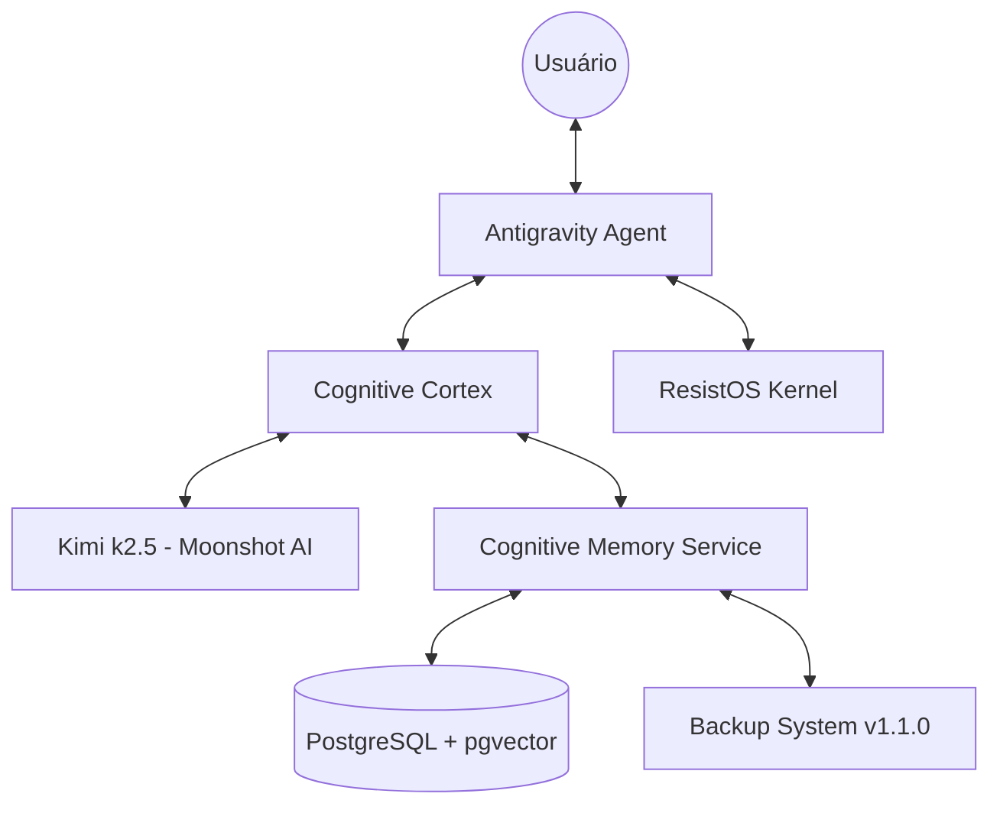

# ANTIGRAVITY SYSTEM REPORT 2026: The Evolutionary Leap
**Status**: Stable / v4.0.0 Operational
**Authors**: Antigravity Agent & Project-Planner

---

## 1. Visão Geral (The Big Picture)
Este relatório documenta a evolução do sistema Antigravity de uma ferramenta assistiva para um ecossistema de agentes autônomos com memória persistente estruturada e raciocínio multi-modal de elite.

### Arquitetura de Referência

---

## 2. Habilidades e Skills (The Skillset)

### 2.1 Cognitive Memory Service (CMS)
**Descrição**: Backend universal de memória para IAs. Transforma logs efêmeros em um ledger imutável e consultável semanticamente.
- **Capacidades**:
    - Busca Híbrida (Vetor + Grafo de Conhecimento).
    - Governança de Dados (TTL, Pining, Forget Policy).
    - Auditability (Rastreabilidade total de cada decisão).
- **Dependências**:
    - Docker / Docker Compose
    - PostgreSQL 15+ com `pgvector` extension.
    - Python `httpx`, `sqlalchemy[asyncio]`.

### 2.2 Kimi k2.5 Reasoning Engine
**Descrição**: O "Cérebro" do sistema. Modelo MoE com 1T+ parâmetros otimizado para tarefas de agentes.
- **Capacidades**:
    - **Thinking Mode**: Raciocínio profundo antes da resposta (Chain-of-Thought).
    - **Agent Swarm**: Coordenar até 100 sub-agentes internos para análise paralela.
    - **Visual Coding**: Entendimento nativo de imagens e vídeos técnicos.
- **Dependências**:
    - Moonshot AI API Key.
    - `kimi_client.py` (cliente especializado).

### 2.3 Cognitive Cortex (Orquestrador)
**Descrição**: A camada lógica que decide *como* pensar e *o que* lembrar.
- **Capacidades**:
    - Task Routing: Decidir se a tarefa exige Kimi Thinking ou resposta instantânea.
    - Context Injection: Recuperar memórias relevantes do CMS antes de enviar para o LLM.
    - Evidence Recording: Gravar automaticamente o resultado de cada raciocínio no CMS para aprendizado futuro.
- **Dependências**: `llm_integration/`, `antigravity_memory_backend/`.

### 2.4 Production-Grade Backup (Ops v1.1.0)
**Descrição**: Sistema de resiliência imutável para a memória do CMS.
- **Capacidades**:
    - Backups Diários Atômicos (pg_dump + gzip).
    - Integridade Garantida via SHA256 e Manifest JSON.
    - Retenção de 14 dias com proteção contra falhas (não deleta se o último backup falhar).
- **Dependências**: `pg_dump`, `gzip`, `sha256sum`.

---

## 3. Guia de Evolução (Como Replicar)

Para "evoluir" um novo agente Antigravity usando este repositório:

1.  **Sincronizar Repositório**: Certifique-se de que o novo agente tenha acesso à pasta `Habilidade_de_agente`.
2.  **Carregar Skills**: O agente deve ler o `.agent/agents/frontend-specialist.md` (ou equivalente) para entender a nova persona.
3.  **Configurar Conectividade**:
    - CMS rodando na porta `8090`.
    - API Key da Moonshot em `.env.moonshot`.
4.  **Ativar o Cortex**: Importar o `cognitive_cortex.py` e usá-lo como o orquestrador principal de tarefas.

---

## 4. Próximos Passos (Roadmap)
- [ ] **Fase 6**: Integração nativa com o GenesisCore Foundation (ResistOS).
- [ ] **Fase 7**: Dashboard Visual de Grafos de Memória (UI para navegar nos Concepts do CMS).
- [ ] **Fase 8**: Multi-Agent Swarm distribuído (Kimi coordenando agentes em containers Docker separados).

---

> **Nota Técnica**: Este sistema foi validado em 28/01/2026 com 100% de sucesso nos testes de persistência e raciocínio.
