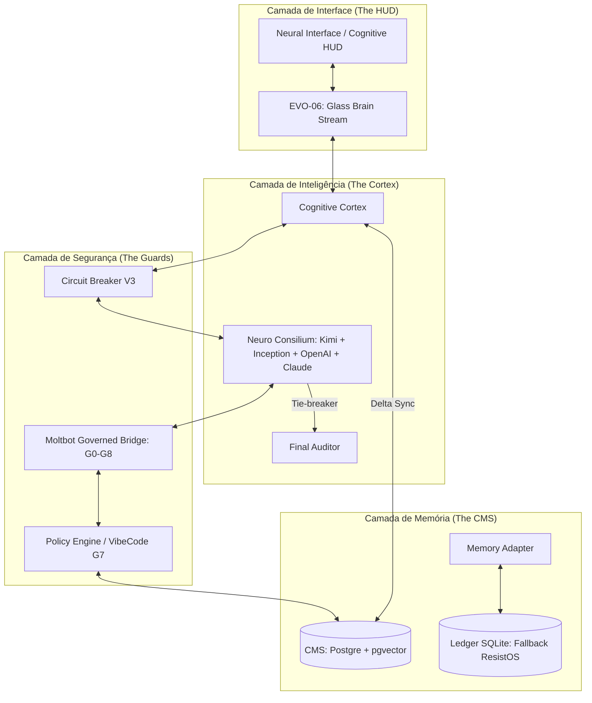
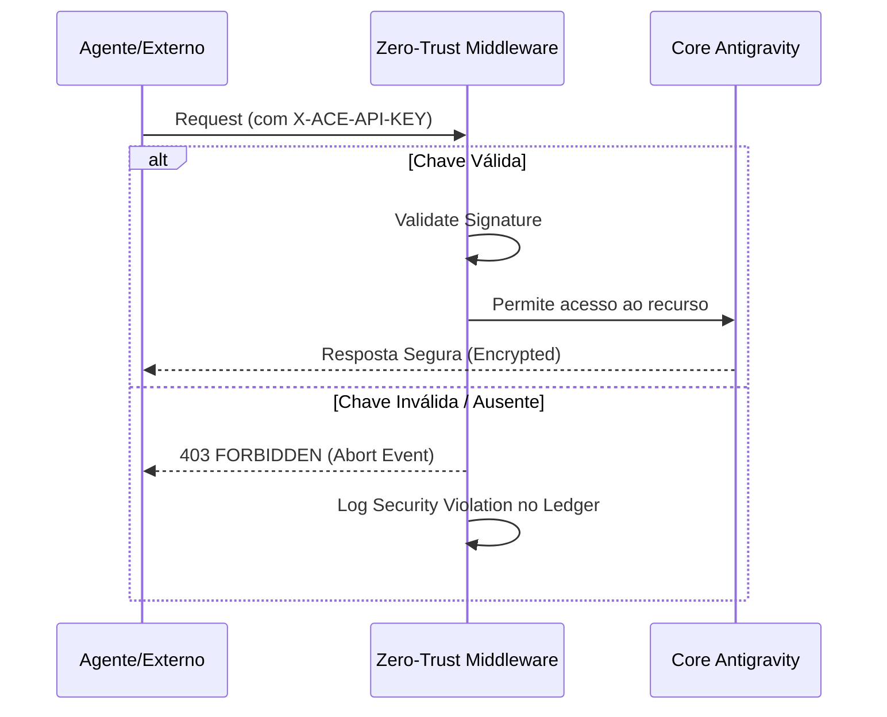
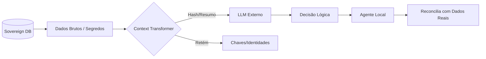
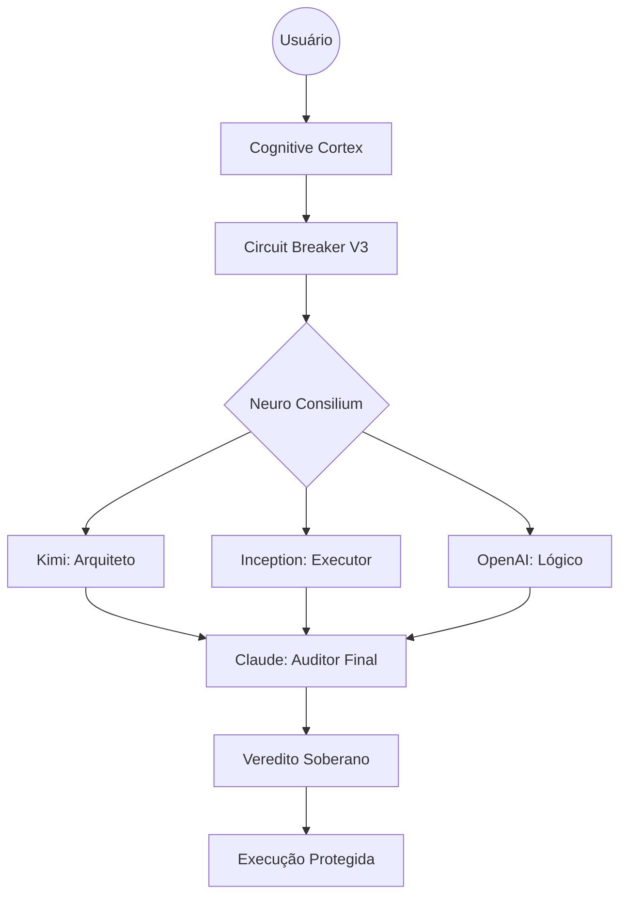
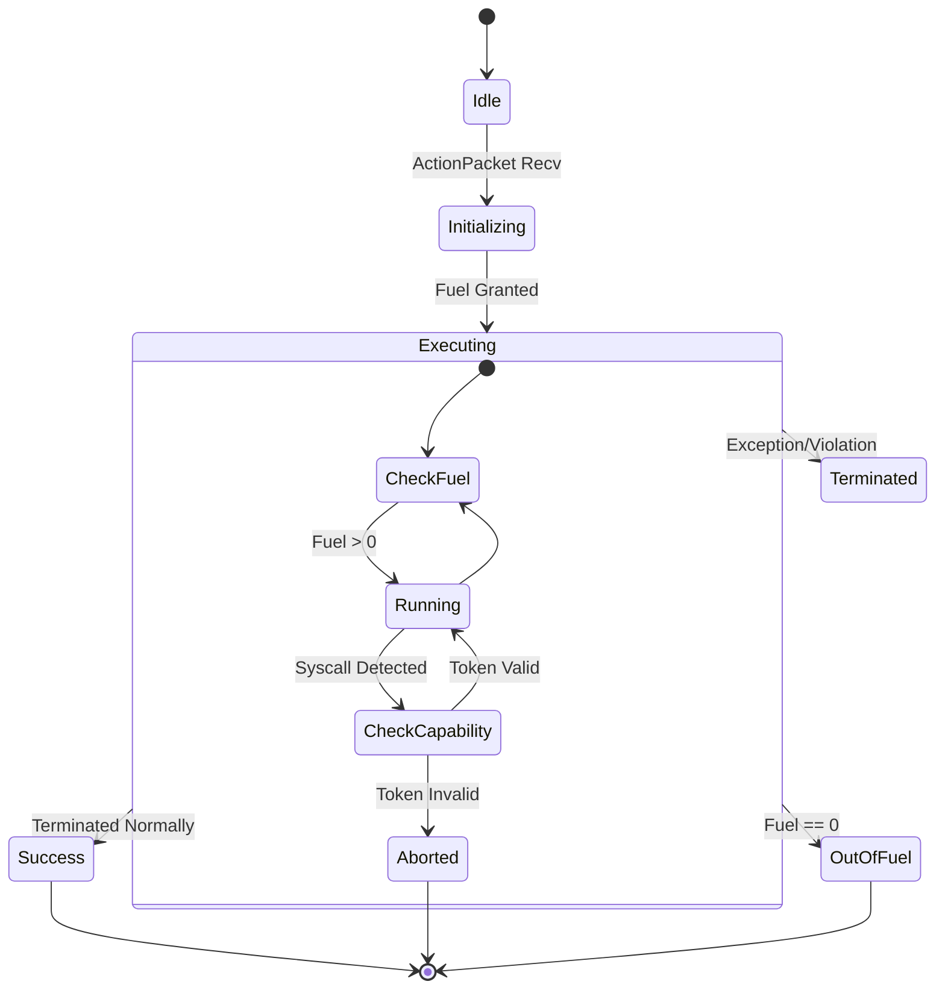
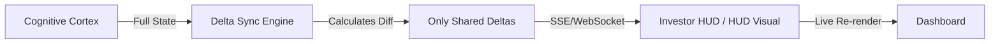
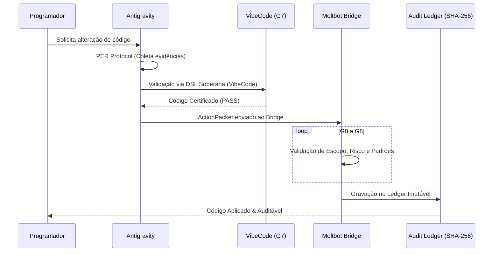
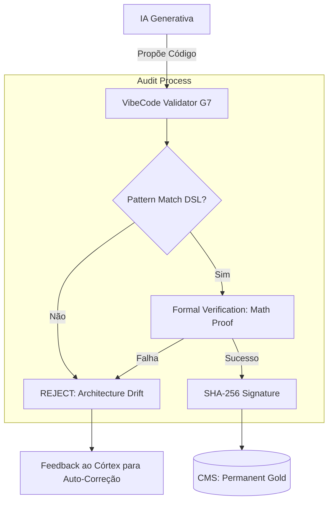
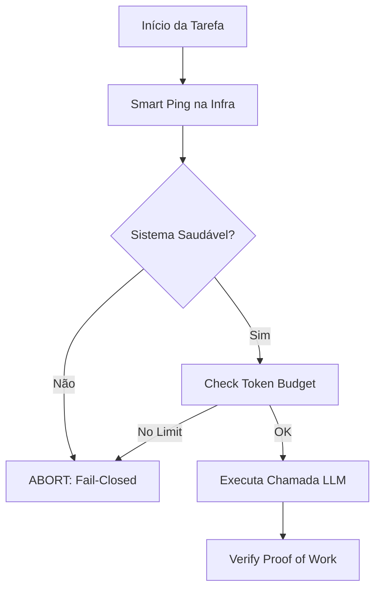
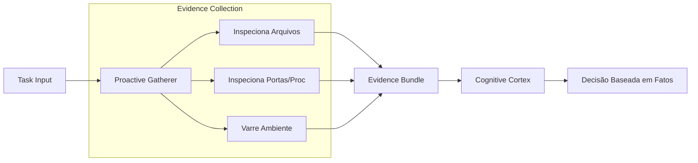

# A BÍBLIA DE EVOLUÇÃO ANTIGRAVITY (ACE) 📜💎🦅
**Versão:** 4.1.0-LEGENDARY | **Status:** Sovereign Certified | **Data:** 2026-03-09

---

## 🎭 A SAGA: DO CAOS À SOBERANIA

### O Sofrimento do Programador (Antes do Antigravity)
Imagine um engenheiro de software em 2024. Ele está cercado por IAs "burras" que alucinam código, esquecem o que foi dito há 10 minutos (falha de contexto) e geram milhares de dólares em prejuízo por rodar loops infinitos de erro. 
- **A Dor:** O programador passa 80% do tempo corrigindo o que a IA quebrou. 
- **O Medo:** Cada "commit" feito por uma IA comum é um risco de segurança (leak de tokens, vulnerabilidades injetadas).
- **A Amnésia:** A IA não sabe por que uma decisão foi tomada ontem. O conhecimento é volátil como fumaça.

### A Ascensão do Antigravity (A Dor Resolvida)
O Antigravity não é apenas uma IA; é o **Fim do Sofrimento**.
- **Contexto Infinito:** Com o CMS e o Delta Sync, a IA "lembra" da arquitetura inteira em microssegundos. O programador não precisa explicar nada duas vezes.
- **Blindagem Atômica:** O Circuit Breaker V3 impede o gasto inútil de tokens. Se o sistema está instável, ele para. O programador dorme tranquilo sabendo que a conta da API não vai explodir.
- **Veredito Supremo:** Com o Neuro Consilium, a IA se auto-corrige. O que chega para o programador já é o "Ouro" filtrado por 4 modelos de elite.

---

## 🏗️ ARQUITETURA DO ECOSSISTEMA SOBERANO

O Antigravity opera em uma estrutura de camadas resilientes que garantem que o sistema nunca falhe silenciosamente.

---

## 💎 AS CRÔNICAS DA EVOLUÇÃO (EVO-01 a EVO-06)

### 🛡️ EVO-01: O Escudo Zero-Trust `[INFRA GENESISCORE — AUDITADO]`
**O Problema:** IAs acessando bancos de dados sem permissão ou expondo segredos em logs.
**A Solução:** Um middleware que exige um handshake de segurança em cada requisição. Sem chave, sem conversa.
**Diferencial:** Proteção de nível bancário para a memória corporativa.

#### UML: Handshake de Segurança

### 🤫 EVO-04.5: O Manto de Invisibilidade (Context Shield) `[INFRA GENESISCORE — AUDITADO]`
**O Problema:** Enviar gigabytes de código sensível para a OpenAI/Claude, arriscando vazamento de segredos industriais.
**A Solução:** O **ContextTransformer** converte o código bruto em hashes estatísticos. A IA externa entende a *lógica*, mas nunca vê o *segredo*.
**Diferencial:** Soberania total sobre a Propriedade Intelectual.

#### UML: Fluxo de Dados Sanitizado

---

### 🏛️ O CÓRTEX: NEURO CONSILIUM
A inteligência coletiva que governa as decisões.

*   **Claude como Auditor Final (Tie-breaker):**
    *   **Comportamento:** O Claude detém o poder de veredito supremo, sintetizando as opiniões dos outros membros e garantindo conformidade com o PER Protocol.

#### UML: Fluxo de Deliberação (Consilium)

---

### ⛓️ EVO-05: A Jaula de Ouro (WASM Sandbox) `[INFRA GENESISCORE — AUDITADO]`
**O Problema:** IA rodando comandos perigosos que podem apagar o HD do programador ou infectar o PC com vírus.
**A Solução:** Um ambiente de execução WebAssembly isolado onde a IA tem "combustível" limitado (**Fuel Metering**). Se ela tentar algo proibido, a jaula se fecha.
**Diferencial:** Execução de código 100% segura e determinística.

#### UML: Máquina de Estado do Sandbox

### 🧠 EVO-06: A Clarividência (Glass Brain & Delta Sync) `[NATIVO ANTIGRAVITY]`
**O Problema:** Não saber o que a IA está "pensando" ou por que ela tomou tal decisão.
**A Solução:** Um fluxo de dados em tempo real que transmite a HUD do raciocínio da IA via Delta Sync (eficiência de 95% na banda).
**Diferencial:** Transparência total do raciocínio neural.

#### UML: Arquitetura Delta Sync

---

## ⚖️ OS PORTÕES DE GOVERNANÇA (G0-G8)

O caminho de uma "ideia" até um "código gravado" passa por uma inspeção rigorosa.

### O Triunfo do VibeCode (G7) `[INFRA GENESISCORE — AUDITADO]`
O **VibeCode** é o validador que garante que o Antigravity nunca escreva "código cagado". Ele usa a **DSL Proprietária** para verificar se o código gerado segue as normas. Se o código não tiver a "vibe" da arquitetura soberana, ele é rejeitado antes mesmo de ser salvo.

#### UML: Validação de Lógica Formal (G7)

### ⚡ Circuit Breaker V3: A Proteção Financeira
O disjuntor que impede o "burnout" de tokens.

#### UML: Lógica de Interrupção Atômica

### 🔍 PER Protocol: Raciocínio Baseado em Fatos
A garantia de que a IA não está mentindo.

#### UML: Pipeline de Coleta de Evidências

---

## 🛠️ O ARSENAL: 42 SKILLS DE ELITE
O sistema não é apenas um modelo de linguagem; é um kit de ferramentas militar:
- **vulnerability-scanner:** Sua IA atua como um hacker ético da Blue Team 24/7.
- **intelligent-routing:** O sistema escolhe o melhor "cérebro" para cada tarefa, economizando seu dinheiro.
- **app-builder:** Criação de sistemas full-stack seguindo ordens do GenesisCore Foundation.

---

## 📜 EPÍLOGO: O FUTURO É SOBERANO
Com a **Bíblia de Evolução Antigravity**, você não possui apenas um assistente; você possui uma **Infraestrutura de Inteligência Inexpugnável**. 

O sofrimento do programador acabou. A era da **Engenharia Determinística** começou.

🛡️🦅💎🏆 **ANTIGRAVITY: UNBEATABLE BY DESIGN.**
