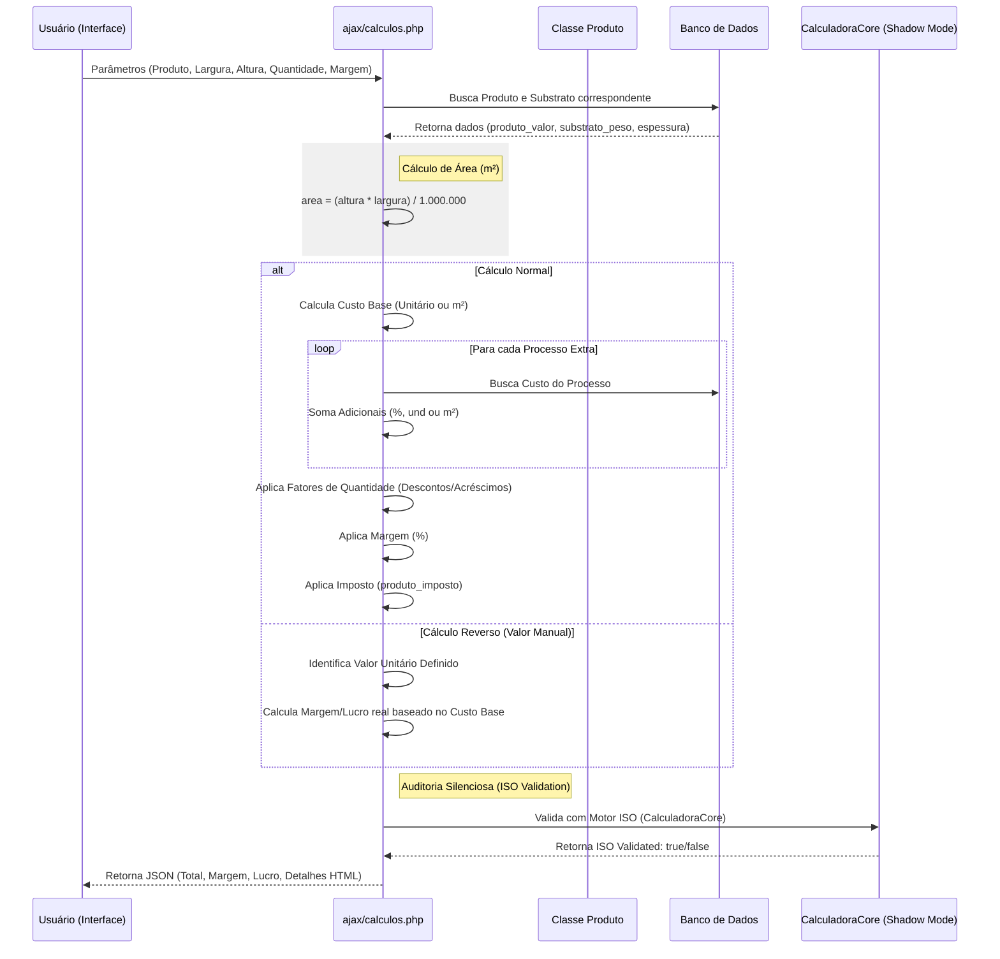

# Mapeamento do Fluxo de Cálculo de Custos

Este documento detalha como o sistema AfixControl processa os custos e valores finais de venda, baseado na análise estática do código ([ajax/calculos.php](file:///c:/Users/RobsonSilva-AfixGraf/Habilidade_de_agente/WORKSPACE/PROJETOS/AfixcontrolAfixgraf/ajax/calculos.php) e [classes/produtos.php](file:///c:/Users/RobsonSilva-AfixGraf/Habilidade_de_agente/WORKSPACE/PROJETOS/AfixcontrolAfixgraf/classes/produtos.php)).

## 1. Fluxo de Sequência da Calculadora

## 2. Pontos de Melhoria Identificados

1.  **Redundância de Código**: O cálculo de processos é repetido em múltiplos arquivos ([calculos.php](file:///c:/Users/RobsonSilva-AfixGraf/Habilidade_de_agente/WORKSPACE/PROJETOS/AfixcontrolAfixgraf/ajax/calculos.php), [produtos.php](file:///c:/Users/RobsonSilva-AfixGraf/Habilidade_de_agente/WORKSPACE/PROJETOS/AfixcontrolAfixgraf/ajax/produtos.php), `novo-orcamento.js`). Recomenda-se centralizar 100% no `CalculadoraCore`.
2.  **Arredondamento**: Existem divergências sutis de arredondamento (`round` vs `number_format`) entre o frontend e o backend que podem acumular centavos em tiragens grandes.
3.  **Peso/Volume**: O cálculo de peso em [calculos.php](file:///c:/Users/RobsonSilva-AfixGraf/Habilidade_de_agente/WORKSPACE/PROJETOS/AfixcontrolAfixgraf/ajax/calculos.php) é simplificado. Poderia considerar o peso específico de cada componente se integrado à telemetria de produção.
